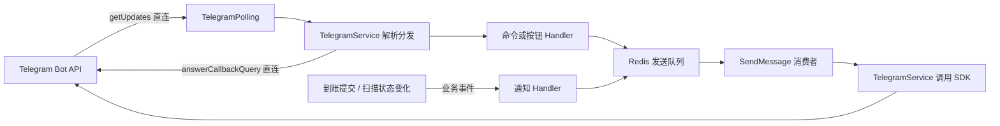
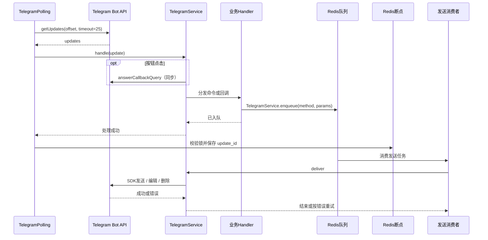

# MGames Telegram 机器人

## 功能与配置

Telegram 官方提供 Bot API，没有官方 PHP SDK。项目使用 Composer 的 `irazasyed/telegram-bot-sdk`，只作为 API 适配层；机器人业务全部由 MGames 自己实现。

```env
TELEGRAM_BOT_TOKEN=
TELEGRAM_BOT_ID=
TELEGRAM_OPS_CHAT_ID=
TELEGRAM_BUSINESS_CHAT_ID=
TELEGRAM_CUSTOMER_CHAT_ID=
```

全局一个机器人，无渠道和代理。Token 为空时不轮询、不投递消息；群 ID 为空时跳过该群通知。API 地址使用 SDK 默认值，无需另配。

`TELEGRAM_BOT_ID` 是机器人的数字 ID，留空则取 Token 冒号前的数字；启动时通过 `getMe` 校验。`/命令@机器人用户名` 使用 `getMe` 返回的 username 匹配，数字 ID 不能用于这个匹配。

| 功能 | 目标与范围 |
| --- | --- |
| `/start`、`/help` | 当前聊天返回帮助，运维群附带状态按钮 |
| `/status`、状态按钮 | 仅运维群，查询扫描就绪状态、下一高度、补扫任务数 |
| 充值到账通知 | 业务群；自动到账、人工确认共用，支持 USDT/TRX |
| 扫描异常、恢复通知 | 运维群；每次异常开始和恢复各通知一次 |
| 客户群 | 预留配置，本期不推送订单或运维信息 |

机器人加入相应群并取得发消息权限后，填写群 ID。私聊和其他群不能查询运维状态。本期不做玩家绑定、余额查询或 Telegram 内下单。

## 结构

| 文件 | 职责 |
| --- | --- |
| `app/process/TelegramPolling.php` | 长轮询、锁、断点，由 Webman 管理 |
| `app/service/telegram/TelegramService.php` | 唯一 SDK 入口、解析分发、入队、实际发送 |
| `app/service/telegram/handler/SystemHandler.php` | 帮助、运维状态、扫描通知 |
| `app/service/telegram/handler/RechargeHandler.php` | 组装到账通知 |
| `app/queue/redis/telegram/SendMessage.php` | 消费、限流重试、异常脱敏 |
| `config/telegram.php` | Bot、群组、命令和按钮映射 |
| `config/event.php` | 业务事件与通知 Handler 的绑定 |

业务只发布事件，Handler 组装消息并入队。没有额外 Client、命令进程入口、Handler 基类或用户绑定表。

## 消息规则

`getUpdates` 和 `answerCallbackQuery` 保持同步调用：前者负责收消息，后者需要立即结束按钮加载状态。

`sendMessage`、`editMessageText`、`deleteMessage` 全部进入 `telegram_message` 队列，独立单消费者，避免 Telegram 请求阻塞资金队列。初始化的 `getMe`、`deleteWebhook` 也是直接调用，不属于待发送消息。

队列载荷仅为 `method + params`，参数沿用 SDK；编辑、删除在 `params` 中传 `message_id`，按钮在 `reply_markup` 中传入数组。

```php
TelegramService::enqueue('sendMessage', [
    'chat_id' => config('telegram.chat_ids.business'),
    'text' => '消息内容',
]);
```

Telegram 返回 429 时按 `retry_after` 延迟重投，最多五次；其他异常沿用现有队列重试及失败队列。延迟重试期间其他消息可继续发送，不承诺严格送达顺序。日志只保留错误类型和错误码，不记录 SDK 原始异常链或包含 Token 的 URL。

## 轮询与一致性

Redis Key：

```text
lock:{telegram:<bot_id>}:polling
forever:{telegram:<bot_id>}:update_id
```

Key 统一定义在 `RedisKey`。锁使用随机 Token、120 秒租约，续期和释放都校验持有者。轮询等待25秒，HTTP超时35秒；无锁实例持续尝试接管。正常停止释放锁，强杀后最多等租约到期。

取锁后校验 Bot 并删除 webhook，再从最后 `update_id + 1` 读取。每条更新处理成功后保存断点；失锁不能派发或推进断点，处理异常保留断点重试。过期按钮应答不阻断后续处理。

到账事务提交并释放资金锁后，才发布 `mgs.recharge.paid`；重复入账不重复发布。扫描进程发布 `mgs.tron.status`。通知监听器故障由事件组件记录，不回滚资金或停止扫描。

本期不增加通知数据库表。进程在入队后、保存断点前崩溃，回复可能重复；事务提交后到通知入队之间崩溃，通知可能遗漏。Telegram 超时重试也可能重复送达。资金正确性由原有订单、流水和入账幂等保证，不能根据群消息判断是否到账。

## 流程图



## 时序图



## 扩展

新增命令或按钮，在 `config/telegram.php` 注册对应的 Handler 方法。Handler 可接收当前消息和完整 update，按需使用参数、按钮数据或发送者身份；业务授权由 Handler 完成。

新增通知，在业务完成后发布事件，在 `config/event.php` 绑定通知 Handler。继续使用现有充值、钱包等 Logic，不在 Telegram 模块复制业务规则。

## 启用与验证

1. `server/` 内执行 `composer install`，安装锁定版本 SDK。
2. 填写 `server/.env`，机器人加入所需群。
3. 重启整个 Webman 服务加载新增进程；生产使用 `systemctl restart mgames.service`。本地使用 `php webman restart`。
4. `php webman status` 检查 `mgs.telegram` 和 Telegram 队列消费者。
5. 发送 `/help`，在运维群点击扫描状态按钮；一次真实充值后核对数据库到账记录及业务群通知。

不要让本地和线上用同一个 Bot 连接不同 Redis 同时轮询，Telegram 会返回 409。群升级后需更新 `.env` 中的群 ID 并重启。

自动测试使用独立 Redis 和模拟 SDK HTTP 响应，不发送真实消息：

```bash
MGS_TEST_REDIS_PORT=<隔离Redis端口> php tests/TelegramSmoke.php --process
MGS_TEST_MYSQL_PORT=<隔离MySQL端口> MGS_TEST_REDIS_PORT=<隔离Redis端口> php tests/MgsTronSmoke.php
```

覆盖 SDK 参数编码、同步应答、权限、队列投递、重启接管、失锁、断点重试、429、日志脱敏，以及到账后通知、重复入账和通知故障不影响余额。
