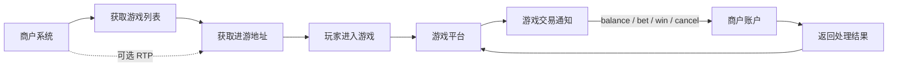
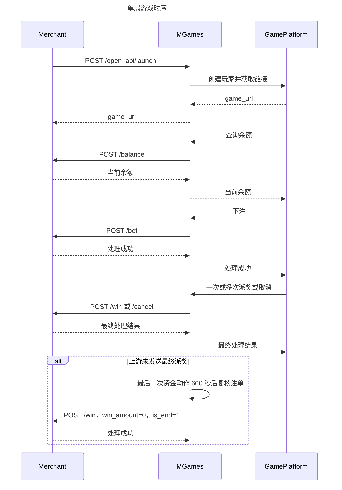

# MGames 商户接入文档

## 1. 接入参数

MGames 开通商户后提供：

| 参数 | 说明 |
| --- | --- |
| `mch_id` | 商户 ID，当前选择为 `{{MCH_ID}}` |
| `secret` | 双向签名密钥，请勿写入前端或日志 |
| API 地址 | `https://mgames.im` |
| 通知地址 | 商户提供，当前配置为 `{{CALLBACK_URL}}` |

普通模式支持一个非 SC/GC 币种。美国市场可使用 SC，也可同时开放 GC；具体开放币种以后台配置为准。

所有接口使用 `POST application/json`。金额使用十进制字符串，时间使用秒级 Unix 时间戳。

## 2. 签名

每次请求都在 JSON 中携带：

| 字段 | 类型 | 说明 |
| --- | --- | --- |
| `mch_id` | string | 商户 ID |
| `timestamp` | int | 当前时间，允许误差 60 秒 |
| `sign` | string | 32 位小写 MD5 |

签名步骤：删除 `sign`，按字段名升序排列，用 RFC 3986 规则拼成 query string，末尾追加 `&secret=密钥` 后计算 MD5。

```php
unset($params['sign']);
$params = array_map(static fn ($value) => $value ?? '', $params);
ksort($params);
$sign = md5(
    http_build_query($params, '', '&', PHP_QUERY_RFC3986)
    . '&secret=' . $secret
);
```

接口参数均为标量。多个玩家 ID 使用英文逗号分隔，避免不同语言对数组序列化产生差异。

## 3. 业务流程





## 4. 接口一览

商户调用 MGames：

| 接口 | 说明 |
| --- | --- |
| `POST /open_api/games` | 游戏列表，必接 |
| `POST /open_api/launch` | 获取进游地址，必接 |
| `POST /open_api/bets` | 查询注单记录，可选 |
| `POST /open_api/rtp` | 设置游戏默认 RTP 或玩家 RTP，可选 |

MGames 调用商户：

| 接口 | 说明 |
| --- | --- |
| `POST {callback_url}/balance` | 查询余额，必接 |
| `POST {callback_url}/bet` | 扣除下注，必接 |
| `POST {callback_url}/win` | 派奖并结束对局，必接 |
| `POST {callback_url}/cancel` | 取消对局，必接 |

## 5. 游戏列表（必接）

```text
POST https://mgames.im/open_api/games
```

请求：

```json
{
  "mch_id": "{{MCH_ID}}",
  "timestamp": {{TIMESTAMP}},
  "language": "{{LANGUAGE}}",
  "game_id": "{{GAME_ID}}",
  "page": 1,
  "limit": 20,
  "sign": "{{GAMES_SIGN}}"
}
```

可选传入 `game_id`、`keyword` 或统一品牌编码 `brand_code`。当前真实游戏示例：

```json
{
  "code": 200,
  "message": "success",
  "data": {
    "list": [
      {
        "game_id": "{{GAME_ID}}",
        "name": "{{GAME_NAME}}",
        "icon_url": "{{GAME_ICON}}",
        "brand_code": "{{BRAND_CODE}}",
        "brand_name": "{{BRAND_NAME}}",
        "game_type": {{GAME_TYPE}},
        "currencies": {{CURRENCIES}},
        "support_demo": {{SUPPORT_DEMO}},
        "support_rtp": {{SUPPORT_RTP}},
        "rtp_options": {{RTP_OPTIONS}}
      }
    ],
    "total": 1
  }
}
```

以接口实际返回的名称、图片和 `total` 为准。商户保存 `game_id`，后续进游和 RTP 都使用该值。

## 6. 获取进游地址（必接）

```text
POST https://mgames.im/open_api/launch
```

请求：

```json
{
  "mch_id": "{{MCH_ID}}",
  "timestamp": {{TIMESTAMP}},
  "user_id": "{{USER_ID}}",
  "game_id": "{{GAME_ID}}",
  "currency": "{{CURRENCY}}",
  "language": "{{LANGUAGE}}",
  "back_url": "https://mgames.im",
  "sign": "{{LAUNCH_SIGN}}"
}
```

`user_id` 是商户侧稳定且唯一的玩家 ID。无需提前同步玩家，首次进游会自动创建。`currency` 可选：游戏支持 SC 时省略即使用 SC；使用 GC 时必须明确传 `GC`；普通单币游戏省略时使用其可用币种。

响应：

```json
{
  "code": 200,
  "message": "success",
  "data": {
    "game_url": "https://game.example/launch/demo-token",
    "user_id": "{{USER_ID}}",
    "game_id": "{{GAME_ID}}"
  }
}
```

## 7. 注单记录（可选）

```text
POST https://mgames.im/open_api/bets
```

请求：

```json
{
  "mch_id": "{{MCH_ID}}",
  "timestamp": {{TIMESTAMP}},
  "month": "{{BETS_MONTH}}",
  "user_id": "{{BET_USER_ID}}",
  "page": 1,
  "limit": 20,
  "sign": "{{BETS_SIGN}}"
}
```

`month` 使用 `YYMM`，可选传入 `user_id`、`status`、`date_start` 和 `date_end`。响应示例：

```json
{
  "code": 200,
  "message": "success",
  "data": {
    "list": [
      {
        "bet_id": "{{BET_ID}}",
        "user_id": "{{BET_USER_ID}}",
        "game_id": "{{BET_GAME_ID}}",
        "game_name": "{{BET_GAME_NAME}}",
        "currency": "{{BET_CURRENCY}}",
        "round_id": "{{BET_ROUND_ID}}",
        "bet_amount": "{{BET_AMOUNT}}",
        "win_amount": "{{BET_WIN_AMOUNT}}",
        "rollback_amount": "{{BET_ROLLBACK_AMOUNT}}",
        "ggr_amount": "{{BET_GGR_AMOUNT}}",
        "status": {{BET_STATUS}},
        "business_date": "{{BET_BUSINESS_DATE}}",
        "settled_time": {{BET_SETTLED_TIME}}
      }
    ],
    "total": {{BET_TOTAL}}
  }
}
```

## 8. 设置 RTP（可选）

```text
POST https://mgames.im/open_api/rtp
```

设置该商户下当前游戏的默认 RTP：

```json
{
  "mch_id": "{{MCH_ID}}",
  "timestamp": {{TIMESTAMP}},
  "game_id": "{{GAME_ID}}",
  "currency": "{{CURRENCY}}",
  "rtp": "{{DEFAULT_RTP}}",
  "sign": "{{RTP_GAME_SIGN}}"
}
```

默认 RTP 会在玩家下次进入该游戏前应用。只调整指定玩家时增加 `user_ids`：

```json
{
  "mch_id": "{{MCH_ID}}",
  "timestamp": {{TIMESTAMP}},
  "game_id": "{{GAME_ID}}",
  "currency": "{{CURRENCY}}",
  "rtp": "{{PLAYER_RTP}}",
  "user_ids": "{{USER_ID}}",
  "sign": "{{RTP_USER_SIGN}}"
}
```

玩家 RTP 优先于游戏默认 RTP。指定玩家必须至少成功进游一次。只有 `support_rtp=1` 的游戏可调用；`rtp_options` 非空时必须使用返回的档位。`currency` 的省略规则与进游一致，使用 GC 时必须明确传 `GC`。

## 9. 商户通知地址

商户只配置一个通知基础地址，MGames 直接在其后追加方法名。

当前选择商户的实际请求地址为：

```text
{{CALLBACK_URL}}/balance
{{CALLBACK_URL}}/bet
{{CALLBACK_URL}}/win
{{CALLBACK_URL}}/cancel
```

以下请求都使用第 2 节相同签名。商户成功响应统一为：

```json
{
  "code": 0,
  "message": "success",
  "data": {
    "balance": "12678.39"
  }
}
```

## 10. 查询余额（必接）

```json
{
  "mch_id": "{{MCH_ID}}",
  "timestamp": {{TIMESTAMP}},
  "user_id": "{{USER_ID}}",
  "currency": "{{CURRENCY}}",
  "sign": "{{BALANCE_SIGN}}"
}
```

玩家不存在、币种不匹配或账号不可用时返回明确业务错误，不得自动创建钱包账户。

## 11. 下注（必接）

```json
{
  "mch_id": "{{MCH_ID}}",
  "timestamp": {{TIMESTAMP}},
  "user_id": "{{USER_ID}}",
  "game_id": "{{GAME_ID}}",
  "currency": "{{CURRENCY}}",
  "transaction_id": "{{BET_TRANSACTION_ID}}",
  "parent_round_id": "{{PARENT_ROUND_ID}}",
  "round_id": "{{ROUND_ID}}",
  "bet_amount": "10.00",
  "sign": "{{BET_SIGN}}"
}
```

商户按 `transaction_id` 幂等扣款。余额不足时返回业务失败，不修改余额。

## 12. 派奖（必接）

```json
{
  "mch_id": "{{MCH_ID}}",
  "timestamp": {{TIMESTAMP}},
  "user_id": "{{USER_ID}}",
  "game_id": "{{GAME_ID}}",
  "currency": "{{CURRENCY}}",
  "transaction_id": "{{WIN_TRANSACTION_ID}}",
  "parent_round_id": "{{PARENT_ROUND_ID}}",
  "round_id": "{{ROUND_ID}}",
  "win_amount": "6.00",
  "is_end": 1,
  "sign": "{{WIN_SIGN}}"
}
```

同一局可以收到多次 `/win`，每次有独立 `transaction_id`。中间派奖传 `is_end=0`，最后一次传 `is_end=1`。没有派奖也会收到 `win_amount=0`、`is_end=1`，是否结束只看 `is_end`。

个别游戏平台不会发送零派奖结束通知。MGames 会为每个未结单注单维护唯一延迟任务；每次新的下注、派奖或取消都会把期限重新顺延 600 秒。到期后系统会再次确认注单仍未结束，才发送 `win_amount=0`、`is_end=1`，已结单则直接跳过。

## 13. 取消（必接）

```json
{
  "mch_id": "{{MCH_ID}}",
  "timestamp": {{TIMESTAMP}},
  "user_id": "{{USER_ID}}",
  "game_id": "{{GAME_ID}}",
  "currency": "{{CURRENCY}}",
  "transaction_id": "{{CANCEL_TRANSACTION_ID}}",
  "original_transaction_id": "{{BET_TRANSACTION_ID}}",
  "parent_round_id": "{{PARENT_ROUND_ID}}",
  "round_id": "{{ROUND_ID}}",
  "sign": "{{CANCEL_SIGN}}"
}
```

商户通过 `original_transaction_id` 定位原局，退回全部下注、扣回已派奖金额，并把该局标记为已取消。重复取消直接返回当前结果，不得再次修改余额。

## 14. 幂等和错误处理

- `/bet`、`/win` 按“接口 + 玩家 + 币种 + 游戏 + `transaction_id`”幂等。
- `/cancel` 按对局取消状态幂等，`transaction_id` 用于跟踪本次请求。
- 相同幂等键但金额或局号不同，应拒绝并告警。
- HTTP 5xx、连接中断、超时、非 JSON 响应都属于结果未知。MGames 会使用原 `transaction_id` 重试。
- 商户必须在本地数据库事务成功后再返回成功，不能先返回再异步变账。

建议错误码：

| code | 说明 |
| --- | --- |
| `0` | 成功 |
| `1001` | 参数错误 |
| `1002` | 签名错误 |
| `1003` | 商户或玩家不可用 |
| `2001` | 余额不足 |
| `2002` | 重复请求参数不一致 |

## 15. SC / GC

- 美国市场可以只使用 SC；需要使用 GC 时明确传入 `currency=GC`。
- 普通模式仅支持一个非 SC/GC 币种。
- SC 通常按 `1 SC = 1 USD` 参与结算。
- GC 可配置展示比例，例如 `1 USD = 10000 GC`；GC 有完整余额、下注、派奖、取消和对账记录，但默认不产生结算费用。
