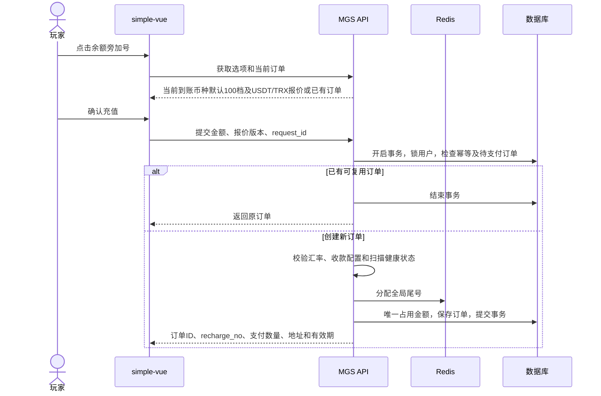
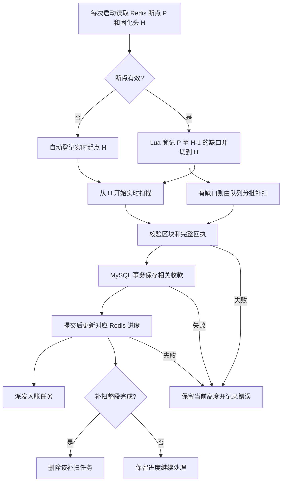
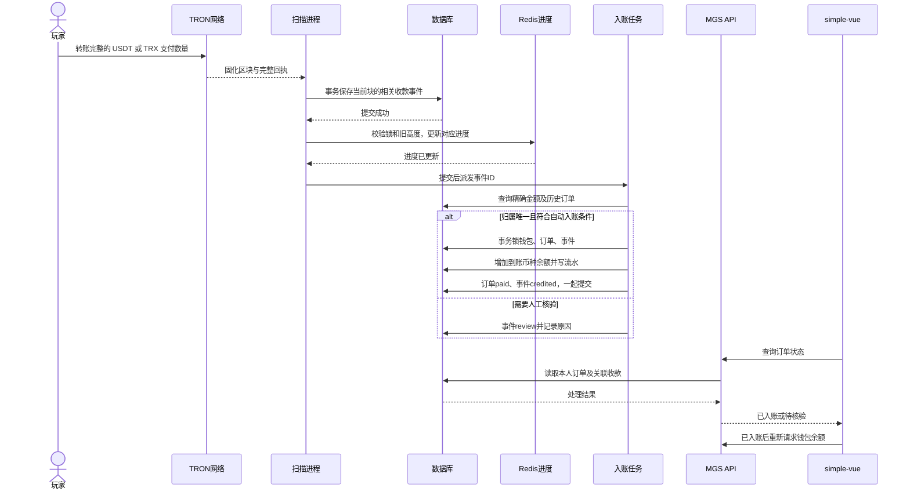

# simple-vue 充值技术方案

> 已实现下单、Redis实时扫描/队列补扫、USDT/TRX收款解析、自动入账、后台核验、二维码支付，以及区块状态和个人充值记录。现有线上充值已完成单笔链上交易、收款、订单和资金流水核对；部署时通过 `db:upgrade` 同步菜单和索引，并重启扫描进程、构建两端页面。通知送达不作为入账依据。

## 1. 功能

- 余额右侧增加 `+`，点击打开充值弹层，适配手机、明暗主题和现有语言。
- 所有支持的充值币种共用默认档位：`10、20、50、100、200、300、500、1000、2000、5000、10000、50000、100000`，默认选中 `100`。档位由服务端统一定义，金额单位为当前充值币种。
- 使用 TRON 主网收款：USDT 为 TRC20 代币，TRX 为原生币。业务支付方式沿用 `trc20` 编码；到账币种不设白名单，有当日有效汇率即可报价，例如 `INR`、`USD`、`EUR`。
- 本期完成下单、区块扫描、自动入账、订单查询、后台充值记录和异常收款核验。
- 初始余额仍为零；创建订单不加余额，确认收款后向对应币种钱包增加所选金额。暂不做赠送、活动、提现、链上退款和归集。

## 2. 充值弹层

| 阶段 | 展示与操作 |
|---|---|
| 选择金额 | 默认选中当前到账币种的 100 档，展示各支付币种的预估支付数量；切换档位不下单、不占用尾号 |
| 确认充值 | 服务端校验最新报价，创建订单并返回支付币种、支付数量和报价快照 |
| 等待付款 | 展示订单号、到账币种及金额、支付币种及数量、TRC20 网络、地址二维码、复制按钮和倒计时 |
| 已入账 | 展示成功状态，重新请求 `/api/wallet` 更新对应币种余额 |
| 已过期 | 停止展示可付款二维码，保留订单信息；提示已转账用户等待核验，不重复付款 |
| 待核验 | 已关联的异常收款展示“付款待核验”；不宣称到账成功 |

- 有未过期订单时直接恢复该订单，锁定金额选项；关闭弹层不取消订单。刷新和多标签页使用同一浏览器账户恢复。
- 弹层打开、页面可见且订单待支付时每 5 秒查询。关闭或页面隐藏后停止，重新打开立即查询。
- 保存最近 `mgs_recharge_id` 查询订单，展示和复制 `recharge_no`。过期、待核验订单允许手动查询；后台入账后刷新余额也能看到结果。
- 提示：“仅支持 TRC20 网络，请按所选支付币种和完整支付数量转账，手续费由付款方承担。”二维码只编码收款地址，金额单独复制。
- 二维码直接使用 `qrcode.vue` 的 `QrcodeSvg`，不自写编码算法；纯本地生成，不向外部二维码服务发送收款信息。
- 倒计时按接口 `server_time` 校准。没有“我已付款即到账”操作，浏览器不能修改订单状态。
- 浏览器凭证仍用于访问账户，提示用户保留浏览器数据；清除数据不会自动找回账户。

### 2.1 图标

- 不换图标库。simple-vue 与 energy PWA 均使用 `@lucide/vue`，充值入口使用现成的 `CirclePlus`；不升级依赖，不重新绘制。
- 图标 18px、点击区域至少 24px，与金额同一条垂直中心线；余额不换行。手机只隐藏钱包装饰图标，不隐藏充值按钮。保留“充值”提示和无障碍名称。
- 币种图标与操作图标分开。余额前显示当前到账币种图案，支付选项显示 USDT/TRX 图案；币种文字始终保留，不能只靠颜色判断。
- crash 的 `sprite.3417c73a.svg` 约 283 KiB，InOut 的 `sprite.4de80bac.svg` 约 293 KiB；两者都按币种编码组织 `<g id>`，含 INR、USD、EUR 等，但均没有 USDT/TRX。InOut 这份可参考同类币种图案和配色，不能直接代替完整支付币种图标集。
- 只借鉴组织方式，不提取第三方图案。自有图形集中在 `simple-vue/src/assets/currencies.svg`，通过 `CurrencyIcon` 和外部 `<use>` 复用；构建生成带 hash 的文件名。本版原始约 2.31 KB，gzip 约 0.60 KB。
- 提供 USD、INR、EUR、GBP、JPY、CNY、USDT、TRX 专用标记，其他币种用同文件的圆形底图叠加代码，不限制币种。图标为项目自制界面标记，不表示官方认证；币种图标本身不增加依赖。

### 2.2 订单状态

订单状态与链上收款状态分开维护：

| 订单状态 | 含义 | 可进入状态 |
|---|---|---|
| `pending` | 已下单，等待付款 | `paid`、`expired`、`review`、`closed` |
| `expired` | 到期时未完成自动入账 | `paid`、`review` |
| `review` | 有收款但无法自动确认归属或金额 | `paid`、`closed` |
| `paid` | 已完成钱包入账 | 终态 |
| `closed` | 管理员确认不再处理 | 终态 |

`expired` 不代表付款无效。若后来发现的区块时间仍在订单有效期内，按原订单自动入账；超时、少付、多付、金额复用或归属不明时进入 `review`。只有余额事务成功提交后，订单才能变为 `paid`。

收款事件独立维护：`pending → credited / review`；人工核验后 `review → credited / ignored`。`ignored` 可由管理员恢复为 `review`，`credited` 不可撤销。订单和事件的到账状态在同一事务提交。

## 3. 汇率与应付金额

### 3.1 每日汇率与支付报价

到账币种的法币或稳定币汇率只读复用 `mg_exchange_rates`，订单、资金和统计使用 MGS 表。现有快照基准为 USD，“今日”沿用快照的 **UTC 日期**，前端展示汇率日期。

```text
到账币种为 INR：usd_per_unit = 1 / rate_json.INR
到账币种为 USD：usd_per_unit = 1
其他币种：       usd_per_unit = 1 / rate_json[currency_code]

currency_code 为入账币种，例如 INR；USD 作为快照基准币种，汇率为 1。
usd_per_unit 的单位：USD / 到账币种
```

`USDT` 按 1 USD 计价；`TRX` 不使用静态汇率，使用 OKX 公共行情接口的 `TRX-USDT` 现货最新价。OKX 行情服务定时刷新并保存 UTC 时间、交易对、价格、来源和请求时间；报价过期或接口异常时暂停 TRX 新下单，不使用旧报价。

没有当日到账币种快照或有效汇率时暂停该币种新下单，不使用旧日汇率。已有订单继续按下单报价收款。

到账币种快照固定选择 `source=currencyapi`、`base_currency_code=USD`。OKX 只读行情使用 `GET /api/v5/market/ticker?instId=TRX-USDT`，充值请求不访问外部汇率源，只读取最近有效快照。

订单保存到账币种汇率、支付币种行情、UTC 日期、来源更新时间、换算值，以及 `pricing_policy=exchange_snapshot / usd_parity / okx_trx_usdt`。报价变化需重新确认，订单创建后不重算。

### 3.2 计算

```text
pay_usd         = USDT取1；TRX取OKX的TRX-USDT价格
target_usd      = 所选到账金额 × usd_per_unit
pay_base_amount = 四舍五入(target_usd / pay_usd, 2)
amount_suffix   = 全局分配的 1～99
pay_amount      = pay_base_amount + amount_suffix / 10000

USDT：23.23 + 0.0001 → 23.2301 USDT
TRX：  23.23 + 0.0001 → 23.2301 TRX
```

- PHP 8.4 使用 BCMath 和 `bcround(..., 2, RoundingMode::HalfAwayFromZero)`。金额通过字符串传输，前端只展示，不计算应付金额。
- `pay_base_amount`、`amount_suffix` 只是计算变量，不建字段。只保存最终 `pay_amount`；例如 `23.2301` 的基础数量是截断后的 `23.23`，尾号是第 3～4 位 `01`。
- USDT 与 TRX 均按 TRON 链上 6 位精度保存和比较，例如 `23.230100` 等于 `23.2301`，`23.230101` 不相等，禁止先四舍五入再匹配。
- 对应币种钱包只增加所选档位金额；识别尾数不再兑换入账。充值和尾数都不计入游戏 GGR。

### 3.3 尾号与金额占用

Redis 全局计数器 `ForeverMgsRechargeSuffix`，值按 `01 → … → 99 → 01` 循环，通过 Lua 原子分配，无 TTL。订单重试不重新分配，允许跳号。

不用金额摘要字段。数据库唯一索引 `(pay_method, pay_currency_code, receive_address, pay_amount, is_reserved)` 防止同时占用；`is_reserved` 占用时为 `1`，释放时为 SQL `NULL`。冲突取下一尾号，最多尝试 99 次；Redis 故障不新建订单，重建后仍由数据库防重。

**为什么留 `is_reserved`：** 两人都被分配 `23.2301 USDT` 时，数据库必须拒绝第二笔占用；旧订单释放后，同一数量又应允许新订单使用。`1` 参与唯一约束，`NULL` 允许多条历史记录，不能用 `0` 代替释放。它不代表付款成功，也不由前端提交；链上充值的收款地址必须非空，否则联合唯一约束不能承担防撞作用。

它不是所有充值系统必需的字段，但在“共用地址＋尾数识别＋允许数量复用”的方案里，保留一列最简单。删除后就需要额外占用表或数据库串行锁加查询，不能只靠自增 ID、循环尾号或 Redis 锁。本版由服务端仅写 `1` 或 `NULL`，不接受客户端传入；数据库联合唯一索引负责并发防撞。

有效期默认 **15 分钟**。待支付、待核验订单保留占用；已支付、过期或关闭的订单，在 `max(expire_time, credited_time) + 24 小时` 后清空 `is_reserved`，不改原金额和历史。`credited_time` 为空时取 `expire_time`，不另存释放时间。恢复核验不抢占已分配给其他订单的金额。

同一支付方式、币种、地址和基础数量最多有 99 个占用槽。循环和隔离期只能避免当前订单撞单，不能识别很久以后按旧金额转来的钱：

- 自动匹配同时检查付款发生前的全部同地址、同金额历史订单，不仅查最近 99 条或当前待支付订单。
- 同一组合曾分配给其他订单，无法仅靠金额确定归属，转人工核验；不能默认给最新订单入账。
- **反复复用同一金额后，人工核验会增多。** 本期保留四位金额方案；若要求长期高并发、全部自动到账，应另行改为每单独立收款地址或有唯一支付单号的通道。

## 4. 下单接口

沿用 `/api` 和浏览器 Bearer 凭证，用户从凭证读取。统一响应 `{code,message,data}`，金额为字符串，时间为 UTC ISO 8601 字符串。

| 方法 | 路径 | 内容 |
|---|---|---|
| GET | `/api/recharges` | 本人全部币种充值记录，按 ID 倒序，每页 10 条；返回 `list/page/has_more`，使用现有浏览器用户认证 |
| GET | `/api/recharges/options` | 到账币种、默认档位、USDT/TRX 各档预估支付数量、报价日期、`quote_key`、支付方式、充值可用状态 |
| POST | `/api/recharges` | 传 `request_id`、`currency_code`、`recharge_amount`、`pay_currency_code`、`quote_key` 创建订单 |
| GET | `/api/recharges/current` | 返回 `data.order`，无当前订单时为 null |
| GET | `/api/recharges/{id}` | 按订单自增 ID 查询本人订单及关联收款，包含 `server_time` |

`options/current` 传到账币种和支付类型，例如 `currency_code=INR&pay_currency_code=TRX`。到账币种不设白名单，仅校验币种编码和有效汇率；支付币种为 USDT/TRX。静态路由优先于 `{id}`。客户端不能指定用户、汇率、尾号、收款地址或最终支付数量。查询始终同时匹配订单 ID 和登录用户，不能只凭 ID 返回订单。

- `quote_key` 为币种、报价、汇率政策及收款配置的版本摘要。创建时重算校验，不新增报价表。
- 玩家首次确认下单时用浏览器内置 `crypto.randomUUID()` 生成 `request_id`（UUID v4，36 个字符，含连字符），例如 `550e8400-e29b-41d4-a716-446655440000`。**不含年月日，也不拼接日期、用户 ID 或自增 ID。** 日期查服务端 UTC `create_time`；请求编号只用于识别同一次下单，不用于排序、分表或授权。
- 发请求前保存编号与到账币种、金额、支付币种；网络超时、刷新、多次点击都复用同一编号。拿到订单 ID 后查询原单，不重新下单；只有用户明确发起下一笔才生成新编号。旧参数重试返回原订单，包括已结束订单；同编号换参数则拒绝。
- 自增 `id` 用于数据库关联、队列参数和流水定位；`recharge_no` 用于页面展示、复制及客服查单；`request_id` 识别同一次下单。三个值不互相替代，查询仍验证登录用户。
- 创建事务锁定用户行，同一用户、到账币种只保留一笔未过期待支付订单；不同请求号的新单提示先处理原订单，通过 `current` 恢复。
- 用户级下单限流只作用于创建接口，重试原订单及查询不消耗新单额度，避免反复占满尾号。

### 4.1 业务单号

`recharge_no` 由服务端创建订单时调用现有 `mg_no('MR')`，不另写生成算法：

```text
MR + yyMMddHHmmss（UTC）+ 12位随机十六进制字符
示例：MR260917083005a1b2c3d4e5f6
```

默认共 26 个字符，字段预留 `VARCHAR(40)`，加唯一索引。下单重试返回原单号，不重新生成；不把它当付款凭证、登录凭证或分表依据。统计及流水月份仍以数据库时间为准，不解析单号推算。

创建、当前订单、详情接口均返回 `mgs_recharge_id`、`recharge_no`。详情路由仍为 `/api/recharges/{id}`，不再增加第二套查询路由；后台列表提供 `recharge_no` 精确筛选。



## 5. TRON 区块扫描

### 5.1 存储边界

| 数据 | 保存位置 | 清理规则 |
|---|---|---|
| 实时扫描断点 | Redis | 无 TTL，持续保留 |
| 未完成补扫范围、进度、错误 | Redis | 无 TTL，整段完成后删除 |
| 心跳、节点最新状态、执行锁 | Redis | 短期 TTL，过期视为不健康或锁失效 |
| 原始区块、无关交易 | 进程内存 | 处理后丢弃 |
| 实际收款及必要链上证据 | `mgs_transfers` | 保留核账、幂等和人工核验依据 |
| 充值订单、钱包余额和流水 | 现有 MGS 业务表 | 不随扫描进度清理 |

扫描调度不依赖 MySQL：断点、缺口、心跳、重试都在 Redis。解析到真实收款后才调用 MySQL 收款处理；该块收款落库失败不得推进进度。队列消息只是执行通知，不是进度的唯一来源。

### 5.2 实时扫描与队列追赶

`mgs.tron-scan` 为 Webman 单进程，使用默认事件循环，随服务启停。每次串行处理有界批次，不在 HTTP 请求中扫块。

1. **每次启动或重启都从最新已固化块 `H` 开始**，不区分停机长短或缺口大小。这里的“最新”是固化头，不是尚未确认的最新链头。
2. 从 Redis 取原 `next_block_number=P`。`P<H` 就将 `[P,H-1]` 登记为补扫任务，哪怕只差一块；`P=H` 无缺口；若 `H=P-1`，该块已扫过，可安全重扫，不创建空任务。节点落后更多时暂停并重试，不倒退覆盖断点。
3. **先登记缺口，才能切到 `H`。** 同一 Lua 脚本内校验锁 Token 和旧断点，保存缺口，设置实时起点 `H` 和 `H-1` 的哈希；已有补扫任务原样保留。Redis 失败或结果未知时重新读取，不能在内存里跳块。断点缺失按 5.5 处理，不猜起点。
4. 提交缺口后向 `mgs_tron_backfill` 投递任务 ID。每次消费从 Redis 进度继续，默认最多处理 20 块或 20 秒，未完成则延迟投递下一轮，不一次塞入全部区块。
5. 补扫只更新自己的进度，不推进或回退实时断点。区间起点保存前一块哈希，终点保存预期区块哈希；逐块验证连续性，完成时核对终点。
6. 正常运行时顺序处理新固化块；积压明显或当前块持续获取失败时，也按“先登记缺口、再切到固化头”处理。节点超时、限流、回执缺失均退避重试，不能遗漏失败高度。哈希不一致时暂停并告警，不强行跳过。

实时扫描和补扫复用同一解析、落库逻辑；共享节点请求限速，优先保障实时扫描。`TRON_API_KEYS` 按请求选择密钥，日志不输出密钥。旧收款地址继续从历史订单读取。

手动补扫仍使用：

```bash
php webman mgs:tron-scan --from=<起始高度> --to=<结束高度>
```

命令仅校验固化范围、保存 Redis 任务并投递队列，不同步跑完整区间。默认保持实时扫描运行；重复补扫由收款唯一键防重。

**任务回收与补派发：**

- 每分钟分批遍历 Redis 未完成任务，重新投递已到重试时间的任务。发布失败、队列消息丢失或框架重试耗尽，都不能删除任务。
- 消费者按任务加锁；每块处理成功才保存下一个高度。整段完成后删除任务记录，迟到或重复消息查不到记录就退出。
- 完成日志只记范围和数量，不保留全量区块或已完成任务列表。后台读取当前任务进度和错误，不另建任务历史表。

### 5.3 先落库，再推进 Redis

MySQL 与 Redis 不做跨系统事务。统一顺序是：

1. 在 MySQL 事务中保存当前区块的全部相关收款事件，唯一键冲突时保留原记录及处理状态。
2. 数据库提交成功后，用 Lua 校验锁 Token、期望高度和前一块哈希，再推进实时断点或补扫进度。
3. 派发 `pending` 收款的入账任务；每分钟从数据库补派发遗漏任务。

| 中断位置 | 恢复方式 |
|---|---|
| 数据库提交前 | 断点不变，重新扫描 |
| 数据库提交后、Redis 更新前 | 重新扫描同一块，唯一键避免重复记录 |
| Redis 更新后、入账任务派发前 | 数据库中的 `pending` 收款补派发 |
| 锁过期或旧消费者恢复 | 拒绝其进度写入；已落库事件可安全重放 |

允许重复扫描，不允许断点先走、收款后存。释放锁使用 Token 比较删除；长批次续租，续租失败立即停止推进。Lua 写入前完成参数和键类型检查，不依赖脚本报错回滚已执行的写入。

### 5.4 Redis 状态

Key 统一定义在 `RedisKey.php`；断点和任务不是普通可淘汰缓存。涉及同一 Lua 的 Key 使用共同的 `{mgs:tron:mainnet}` hash tag。

| 枚举 | 类型 | 内容与生命周期 |
|---|---|---|
| `ForeverMgsTronCheckpoint` | string JSON | `forever:{mgs:tron:mainnet}:checkpoint`；实时断点，无 TTL |
| `ForeverMgsTronGaps` | hash | `forever:{mgs:tron:mainnet}:gaps`；字段为任务 ID，值为任务 JSON；未完成不设 TTL，完成删除字段 |
| `TempMgsTronHealth` | string JSON | `temp:{mgs:tron:mainnet}:health`；心跳、观测到的固化高度/时间、错误；TTL 120 秒 |
| `LockMgsTronScan` | string | `lock:{mgs:tron:mainnet}:scan`；Token，TTL 60 秒并续租 |
| `LockMgsTronGap` | string | `lock:{mgs:tron:mainnet}:gap:<任务ID>`；Token，TTL 60 秒并续租 |
| `ForeverMgsTronAddresses` | set | `forever:{mgs:tron:mainnet}:addresses`；历史收款地址，无 TTL，防止改配置后漏旧地址 |

**断点字段：** `start_block_number`、`next_block_number`、`last_block_hash`、`last_success_time`。实时跳过缺口后，`last_block_hash` 只表示新起点的前一块；未完成范围单独保留在补扫任务中。启动时清空心跳，扫描成功后重新更新。

**补扫字段：** `from`、`to`、`next`、`last_hash`、`end_hash`、`attempts`、`retry_time`、`error`。任务 ID 随机生成；Redis时间使用 UTC Unix 秒。任务只存范围、进度和错误，不存区块正文。

### 5.5 自动启动与恢复

- 每次启动自动从最新固化块扫描；已有断点到最新块之间的缺口进入队列，无需人工初始化或恢复确认。
- 充值开关开启、地址有效、实时扫描健康且报价有效即可下单。历史补扫不阻断新充值；实际扫描故障恢复后自动恢复接单。
- Redis 断点缺失或损坏时自动建立最新起点。未知历史范围无法凭空恢复，需按订单时间提交补扫；没有可信备份时从最早充值订单之前开始，不用最后一笔收款高度代替完整断点。
- USDT、TRX 均可支付；`MGS 充值报价`默认启用，每分钟从 OKX 刷新 TRX-USDT 行情。TRX 行情失效仅暂停 TRX，不影响有效的 USDT 报价。

生产 Redis 开启 AOF，并为断点、未完成任务提供不被淘汰的存储。每秒刷盘仍可能丢失最近写入，因此重启后的重复扫描必须安全；持久化不能代替数据库入账幂等。确认 AOF 重写和备份策略，避免日志无限增长。需要调整共享 Redis 策略时单独评审，不随发版修改全局配置。

### 5.6 TRON 收款识别

按支付币种分两路识别，网络始终为 TRON 主网：

1. `USDT`：验证交易成功、回执所属区块正确，核对指定 USDT 合约和 `Transfer(address,address,uint256)` 签名；从日志读取转入地址和整数金额，兼容 `transferFrom`、合约代付和批量转账。
2. `TRX`：验证原生 TRX 成功转账的 `contractData.to_address`、`owner_address` 和 `amount`，只接受转入配置收款地址的交易；合约调用里的 TRX 不按普通转账重复识别。
3. 两路金额都用字符串处理并换算为 6 位最小单位，禁止 `hexdec` 转浮点或手写密码学；零金额、其他代币、失败交易不计入充值。
4. 本期只接 TRON 主网，收款唯一索引为 `(transaction_id, currency_code, event_index)`。TRX 使用原始合约下标，USDT 使用原始日志下标，币种区分这两类来源；不另存网络编码、事件类型或事件摘要键。未来接入其他链时再增加网络维度，不能跨链复用此约束。

扫描地址集合包含当前配置地址和历史订单中的收款地址；改地址不漏掉旧地址迟付。订单保存地址、合约快照，不随配置修改。

### 5.7 扫描流程



无相关收款的区块不产生数据库记录，但仍须校验成功后推进 Redis。缺口登记或进度更新失败均可重试，不能以“消息已投递”代替“区块已处理”。

## 6. 匹配与入账

### 6.1 自动匹配条件

事件来自已固化 TRON 主网区块，且支付币种、收款地址、6 位精确数量一致；USDT 合约还须与订单快照一致。按**区块时间**判断 `create_time ≤ block_time ≤ expire_time`，不用交易创建时间或抓取时间替代付款时间。

只有一笔符合条件的未入账订单，且不存在付款前已创建的其他同组合历史订单，才自动入账。订单已被过期任务标记 `expired`，但实际付款在有效期内，仍可按原订单入账。已关闭订单、停用用户和有歧义的收款转人工。

| 情况 | 处理 |
|---|---|
| 同一链上事件重复扫描、重复消费 | 返回原处理结果，不再加余额 |
| 按时精确付款，扫描或确认延迟 | 按原订单自动入账 |
| 超时付款、金额历史复用、多个候选订单 | `review`，人工核实归属 |
| 少付、多付、拆分付款、无对应订单 | `review`，不拼凑金额或按接近金额自动归属 |
| 已入账订单又收到一笔付款 | 新事件单独留存并转核验，不覆盖原付款 |
| 钱包锁冲突、数据库临时故障 | 事件保留 `pending` 并重试；技术故障不冒充人工核验 |

### 6.2 入账事务

自动到账和后台核验共用一个入账方法，复用 `LockMgsUserWallet(user_id, currency_code)`。事务前准备好对应月份流水表，资金事务内不执行 DDL。

数据库固定按 **钱包 → 充值订单 → 收款事件** 加行锁，再次校验事件及订单状态、匹配信息和用户状态：

1. BCMath 增加 `recharge_amount`，钱包 `version + 1`。
2. 写 `mgs_bills_YYMM`，`type=recharge`、`direction=1`、`transaction_id=recharge:{id}`，记录前后余额；`bet_no/game_id` 为空。
3. 订单仅更新 `status=paid` 和 `credited_time`。交易号、实收数量、付款时间查关联收款记录，不重复存入订单。
4. 收款事件绑定订单并改为 `credited`，整个事务一起提交；任一步失败全部回滚。

流水月份按入账时的 UTC 月份确定。入账前锁定钱包、订单和收款行；订单已 `paid` 或收款已 `credited` 就返回原结果，同一事务内提交余额、流水和两边状态。以单表自增 ID 锁定对象，配合链上收款唯一索引完成跨月防重，不扫描最近几个月流水。需要查流水时，按订单 `credited_time` 找月表，再查 `recharge:{id}`。充值不参与游戏 GGR 或服务费统计。



## 7. 数据表

充值只保留两张单表：充值订单、链上收款。扫描断点、补扫任务均不建表；钱包流水沿用月表。字段写 COMMENT，具体时刻统一 UTC `DATETIME(3)`，金额使用 `DECIMAL`。

### 7.1 `mgs_recharges`

共 **18 个字段**，其中 3 个为框架时间字段。订单只保存“谁充值、付多少、到账多少、是否完成”。

| 字段 | 类型 | 含义 |
|---|---|---|
| `id` | BIGINT UNSIGNED | 自增主键，内部关联使用 |
| `recharge_no` | VARCHAR(40) | 用户可见业务单号，`mg_no('MR')` 生成，包含 UTC 时间和随机段 |
| `user_id` | BIGINT UNSIGNED | MGS 用户；通过用户与到账币种定位钱包 |
| `request_id` | CHAR(36) | 浏览器生成的 UUID v4，无日期前缀；一次下单及重试共用 |
| `currency_code / recharge_amount` | VARCHAR(16) / DECIMAL(24,8) | 到账币种、到账金额 |
| `pay_method` | VARCHAR(32) | 本期 `trc20`；普通支付接入时再增加方式，不预设类型和通道层级 |
| `pay_currency_code` | VARCHAR(16) | `USDT` 或 `TRX` |
| `pay_amount` | DECIMAL(24,8) | 最终支付数量，已经包含识别尾数 |
| `receive_address` | VARCHAR(128) NULL | 收款地址快照；后续非链上支付可空 |
| `is_reserved` | TINYINT UNSIGNED NULL | 金额占用标记：仅 `1` 或 SQL `NULL`，用于唯一索引；不是尾号 |
| `rate_snapshot` | JSON | 本单使用的汇率、行情、来源时间、计价政策及 USDT 合约快照；不重复保存全部档位报价 |
| `status` | VARCHAR(16) | `pending / expired / review / paid / closed` |
| `expire_time / credited_time` | DATETIME(3) / DATETIME(3) NULL | UTC 到期、实际钱包入账时间 |
| `create_time / update_time / delete_time` | DATETIME(3) NULL | 框架时间字段，不提供删除充值订单操作 |

唯一索引：

- `recharge_no`：保证业务单号唯一。
- `(user_id, request_id)`：同一次请求只能生成一笔订单。
- `(pay_method, pay_currency_code, receive_address, pay_amount, is_reserved)`：同一支付数量只能有一个有效占用；释放后允许保留多笔历史订单。TRON 主网 USDT 的资产身份固定，不能仅修改合约配置就把其他代币当成 USDT。

查询索引：`(user_id, currency_code, status, id)`、`(status, expire_time)`。已付款按 `credited_time` 统计，需报表查询时再增加相应索引。

### 7.2 `mgs_transfers`

共 **16 个字段**，其中 3 个为框架时间字段。一行对应一笔实际链上收款，不是充值订单的副本。

| 字段 | 类型 | 含义 |
|---|---|---|
| `id` | BIGINT UNSIGNED | 自增主键，作为入账队列参数 |
| `recharge_id` | BIGINT UNSIGNED NULL | 关联 `mgs_recharges.id`；无法确定归属时为空 |
| `transaction_id / event_index` | VARCHAR(128) / INT UNSIGNED | 链上交易号、原始事件下标 |
| `currency_code / amount` | VARCHAR(16) / DECIMAL(24,8) | 实际收到的币种和数量，按链上 6 位精确比较 |
| `from_address / receive_address` | VARCHAR(128) | 付款地址、收款地址 |
| `block_number / block_time` | BIGINT UNSIGNED / DATETIME(3) | 固化区块高度、UTC 付款时间 |
| `status` | VARCHAR(16) | `pending / credited / review / ignored` |
| `remark` | VARCHAR(500) NULL | 异常原因或核验说明，不再拆 `reason` 字段 |
| `data` | JSON | 相关原始事件、合约和区块哈希；人工处理时追加管理员、UTC时间和处理依据，不保存无关交易 |
| `create_time / update_time / delete_time` | DATETIME(3) NULL | 框架时间字段，不提供删除收款记录操作 |

唯一索引 `(transaction_id, currency_code, event_index)`；查询索引 `(status, id)`、`recharge_id`。交易号及地址区分大小写，区块哈希和合约证据放 `data`，不单独建列。本期 `mgs_transfers` 仅表示链上实际收款，不混入内部钱包转账或提现。

发现时间就是 `create_time`，入账时间查关联订单的 `credited_time`。其他处理动作通过 `data` 的核验记录及管理操作日志追溯，不另设一组处理时间字段。

API 主键分别叫 `mgs_recharge_id`、`mgs_transfer_id`，均直接对应数据库自增 ID；关联充值字段叫 `mgs_recharge_id`，用户字段叫 `mgs_user_id`。充值数据另返回 `recharge_no` 用于展示。API 的 BIGINT 标识统一传十进制字符串，避免浏览器整数精度丢失；仍须校验订单归属。

### 7.3 命名与关联

| 对象 | 统一名称 |
|---|---|
| 充值表及 Model | `mgs_recharges` / `app\model\Recharge` |
| 收款表及 Model | `mgs_transfers` / `app\model\Transfer` |
| 数据库中的充值关联 | `recharge_id → mgs_recharges.id` |
| 数据库中的收款关联（需要时） | `transfer_id → mgs_transfers.id`；不为命名额外新增字段 |
| API 及前端类型 | `mgs_recharge_id`、`recharge_no`、`mgs_transfer_id` |
| 入账队列消息 | `{transfer_id}`，处理时查询该收款及关联充值 |
| 钱包流水关联 | 现有 `transaction_id=recharge:{id}`；不再增加一列充值 ID |

充值和收款继续用单表，不照搬月分表、营销奖励或其他当前不需要的字段。表名、Model、关联、查询、索引名、接口、队列参数、前端类型和测试同时调整，不保留两套名称。

### 7.4 去掉的重复字段

| 字段 | 替代方式 |
|---|---|
| `order_no` | 统一改名 `recharge_no`，不同时保留两个业务单号 |
| `wallet_id` | 通过 `user_id + currency_code` 找唯一钱包 |
| `amount_suffix / pay_base_amount` | 从最终支付数量推导，不存 |
| `exchange_rate_id / exchange_rate_value` | 只保留本单报价快照，不再拆列 |
| `pay_type / provider_code / network_code` | 当前支付方式已明确；新增通道或网络时再设计 |
| `amount_match_key / amount_release_time` | 联合唯一索引和占用标记；释放时间按规则计算 |
| `payment_key` | 使用订单/收款 ID、状态行锁及链上交易联合唯一索引 |
| 订单的 `transaction_id / received_amount / paid_time` | 查关联的实际收款，不复制一份 |
| `bill_no` | 通过入账月份和 `recharge:{id}` 查询已有流水 |
| `detected_time / processed_time / reviewed_by / reviewed_time` | 复用创建时间、订单入账时间和核验记录 |

**三个标识各司其职。** `id` 做内部关联，`recharge_no` 带时间便于人工查单，`request_id` 识别首次下单响应丢失后的重试。同一收款重复扫描仍使用链上交易号、币种和下标唯一索引防重，不再增加摘要键。

## 8. 后台核验与运行配置

### 8.1 后台

| 方法 | 路径 | 用途 |
|---|---|---|
| GET | `/mgs/recharges`、`/mgs/recharges/{id}` | 充值订单列表、详情和关联收款/流水 |
| GET | `/mgs/transfers`、`/mgs/transfers/{id}` | 链上收款及待核验列表、证据详情 |
| POST | `/mgs/transfers/{id}/credit` | 核验后关联订单并入账，传 `mgs_recharge_id` 和处理依据 |
| PUT | `/mgs/transfers/{id}/review` | 保存核验备注或标记非充值收款，不修改金额和余额 |
| GET | `/mgs/tron-scan` | 区块状态：固化高度、已扫描高度、心跳、实时区块流、补扫进度；具备充值查看权限时附带最近 10 笔已到账订单 |

列表支持 `recharge_no`、用户、状态、币种、日期及交易哈希等相关筛选。人工按业务单号找到订单后，核验接口仍提交其 `mgs_recharge_id`，不接受两种可冲突的关联参数。分别提供查看权限和 `app:mgs:recharge:credit`、`app:mgs:recharge:review` 操作权限；普通 MGS 运营角色默认只读，资金操作单独授予。

人工入账也必须对应已固化真实收款、未入账订单和精确金额，只允许解除超时或归属核验限制，不能用此入口任意加余额。付款截图或公开 TXID 本身不能证明账户归属，需核实付款方及目标账户并记录依据。

少付、多付、拆分和退款先留在待核验列表，本期不提供任意金额补账或链上退款。`ignored` 仅表示已核实非充值，不删除资金证据；若需恢复核验，记录管理员及原因。已入账记录不可通过核验接口撤销。核验过程接入管理操作日志，记录变更前后状态、订单关联和处理依据。

### 8.2 配置与运行

- 首版开关、收款地址、节点和行情参数统一读 `.env`。到账币种无需单独配置，支付币种固定 USDT/TRX，有效期 15 分钟。后续后台配置另行接入，不维护两份配置源。

`.env` 配置：

| 变量 | 作用 |
|---|---|
| `MGS_RECHARGE_ENABLED` | 默认 `false`；链上确认与入账完成验证后才可开启 |
| `MGS_RECHARGE_TRON_RECEIVE_ADDRESS` | TRON 主网收款地址；USDT、TRX 共用，可更换但旧订单仍按快照扫描 |
| `MGS_RECHARGE_TRON_USDT_CONTRACT` | 主网 USDT 合约地址，默认 `TR7NHqjeKQxGTCi8q8ZY4pL8otSzgjLj6t` |
| `TRON_URL` | TRON Solidity/节点接口地址，默认 `https://api.trongrid.io` |
| `TRON_API_KEYS` | 多个节点只读 API Key，逗号分隔；请求随机选一个 |
| `OKX_BASE_URL` | OKX 公共 API 地址，默认 `https://www.okx.com` |
| `OKX_TICKER_TTL` | 行情有效秒数，默认 120；同时检查行情源时间，过期只停用 TRX |

收款地址只保存公钥地址，不需要私钥。OKX 行情任务定时读取 `TRX-USDT` ticker，保存价格、采集时间和有效期；不使用交易 API，也不保存 OKX 密钥。USDT 按 1 USD 计价。

`MGS 充值报价` 任务每分钟刷新，默认启用；可用 `php webman mgs:recharge-price` 单次刷新。查询和下单只读有效缓存，OKX 故障不影响 USDT 报价。修改环境配置后重启服务。

地址无效、实时扫描未就绪、心跳超过 2 分钟、固化头超过 3 分钟未更新，或实时扫描落后固化头超过 40 块时，暂停新下单，健康后自动恢复。后台补扫不影响新下单。充值开关关闭只停止新订单，不停止旧收款的扫描和处理。

- 正式收款前核验 TRON 主网官方 USDT 合约、节点固化接口、批量回执能力和限额。系统只监控公开收款地址，不需要钱包私钥。
- 每分钟处理订单过期、金额占用释放、Redis 补扫任务补派发和数据库 `pending` 收款补派发。技术故障不删除未完成任务，也不丢弃收款。
- Redis Key 集中到 `RedisKey.php`，扫描键见 5.4；尾号和钱包锁沿用既有定义。扫描进度以 Redis 为准，实际收款与入账结果以数据库为准。
- 扫描持续落后、节点限流、入账任务堆积和待核验新增均记录结构化日志并在后台提示；不新增未经配置的外部消息发送。
- 日志按天轮转保留7天，成功扫块按分钟汇总；只记录自有收款和错误摘要，不逐块打印完整回执，防止磁盘持续增长。

## 9. 实现与验收

业务代码放 `server/app/`：充值 Controller、Logic、Validate 和 Model；扫描进程放 `app/process/`，TRON解析放 MGS 业务服务，入账任务使用现有队列。前端独立充值弹层，后台复用现有列表、详情和权限组件，不改 SaiAdmin 产品源码。

建表统一更新 `schema.sql`；菜单、配置、任务和精确角色权限更新 `system.php`；路由写 `route.php`；流水模板注释、类型字典、API类型和全部语言包同步补齐。后续普通充值沿用订单和钱包入账规则，增加通道实现，不复制一套钱包逻辑。

### 9.1 移除旧断点表

实施时同步处理，不保留新旧两套断点：

1. 从 `schema.sql` 移除 `mgs_chain_scan_states`；下单健康检查、扫描状态接口、测试夹具全部改读 Redis。
2. 发布前备份并检查旧表。空表无需迁移；若已有可信断点，暂停扫描，将进度转入 Redis 并核对后再切换；无法确认完整性时按 5.5 补扫恢复。
3. `mgs:recharge-schema --apply` 将旧表改名为 `_legacy_...` 备份。新代码不再读取；备份核对后的清理另行安排，常规 `db:upgrade` 不自动删表。

开发版已提供转换命令并通过隔离库测试，尚未在生产执行。发布步骤见根目录 `deploy.md`。

两张充值表的精简也须同步修改 `schema.sql`、模型、接口、前端和测试。已有数据时先核对旧订单号、金额占用和流水关联，再做明确的字段迁移；不能靠常规升级直接丢弃旧列。新订单使用 `recharge:{id}`，历史流水按实际旧标识迁移，不改资金金额。人工核验的历史信息须合并保留，不能随删列丢失。

表名转换单独执行：`mgs_recharge_orders → mgs_recharges`、`mgs_recharge_transfers → mgs_transfers`，关联列 `recharge_order_id → recharge_id`。命令从 `schema.sql` 建临时新表、复制并核对ID/关联，最后原子改名，保留旧表；发版脚本发现未转换旧表会停止。旧请求号不是 UUID v4 或新旧表都有数据时拒绝自动转换，不截断、不合并。

旧 `order_no` 直接迁为 `recharge_no`，保留原值，不给历史充值重新编号。已有流水关联单独核对，不能因改字段名丢失历史查询能力。

### 9.2 验收

| 验收项 | 必须覆盖 |
|---|---|
| 前端 | CirclePlus居中、手机可点击、币种图标缺失不阻断、默认100、十三档、多币种共用档位、主题、语言、订单恢复和轮询清理 |
| 汇率 | 各到账币种换算、USD基准汇率为1、USDT按1 USD、TRX使用OKX行情、行情过期、无当日汇率、跨UTC日、报价变更、四舍五入边界 |
| 金额 | 01/09/99、尾号循环、并发占用、99槽耗尽、Redis重建、6位链上金额精确匹配 |
| 订单 | request_id不拼日期、recharge_no含UTC时间、重试返回相同ID和单号、同请求换参数拒绝、并发、多标签、BIGINT字符串、越权查询 |
| 扫描 | 每次重启直接扫最新固化块、仅差一块也登记缺口、旧补扫任务保留、节点落后不倒退、空块、回执缺失、超时/限流、父哈希异常 |
| Redis | 断点重启、健康标记过期、持久化回退、断点丢失后自动扫描并恢复接单、锁过期后旧进程不能推进 |
| 补扫 | 队列丢消息、重试耗尽后补派发、分批断点恢复、任务不自动过期、整段成功后删除 |
| 跨存储 | MySQL提交失败不推进、提交后Redis失败可重扫、推进后队列失败可补派发 |
| 事件 | TRX原生转账、transferFrom、批量Transfer、同TX多事件、approve、失败交易、假USDT、旧地址迟付 |
| 入账 | 重复消费、事务回滚、跨月、下注并发、迟发现但按时付款、历史金额复用转核验 |
| 后台 | 核验权限、操作留痕、不能重复入账、不能用少付款任意加余额、异常收款不丢失 |
| 表结构 | 新表名与关联列一致、重命名保留ID和数据、is_reserved仅允许1/NULL、释放后可保留多条历史记录 |

开发完成执行 PHP 语法、金额/事务/并发测试、前端类型检查与构建；数据库执行升级预览、升级及 `DbUpgradeSmoke`，验证空库安装与重复升级无差异。

上线前配置收款地址、节点及只读 API Key，确认 Redis 持久化和充值报价任务启用。服务启动后自动扫描，健康检查通过后接单，已知历史缺口由队列补齐。用受控钱包分别验证 USDT/TRX 小额充值，核对“链上收款 → 订单 → 余额 → 流水”，重复扫描和投递后余额不变。

### 9.3 已执行验证

- `MgsRechargeSmoke`：新表下单、UUID、尾号循环、数量占满、重试、并发及无白名单币种报价。
- `MgsTronSmoke`：模拟固化节点、缺回执、失锁重放、补扫、USDT多事件、TRX、自动/人工入账及资金事务回滚。
- `MgsRechargeMigrationSmoke`：旧表转换保留ID、金额、业务单号、流水引用及核验历史。
- `DbUpgradeSmoke`：空库安装和重复升级。测试均使用隔离MySQL/Redis，不修改生产数据。
- 图标通过XML、浏览器明暗主题16/24px检查；前端通过类型检查和构建。
- 真实节点只读探测可返回并解析固化块及完整回执；这不等于真实钱包充值到账验收。


## 区块状态与个人充值记录

- 管理页改为 `/#/mgs/tron-scan`，目录为 `src/views/mgs/tron-scan/`。菜单名称为“区块状态”，稳定菜单 code 和权限码保持不变。
- 页面每秒轮询一个接口，已有请求时跳过；标签隐藏、页面停用或卸载时停止，恢复后立即更新。失败保留上一份数据并显示过期提示，不连续弹出消息。
- 扫描器在断点推进成功后缓存最近 12 个实时区块，保留一小时。补扫不写入实时区块流；展示缓存异常不影响扫描推进。卡片显示实际交易数量和识别收款数量，不把识别收款当成到账。
- 最近成功充值从 `mgs_recharges.status=paid` 查询，按 `credited_time/id` 倒序，关联已入账收款，缓存一秒。数据组装放在管理 Logic，不扩展接单判断使用的扫描 `status()`，也不修改到账事件。
- 本人记录放在个人中心游戏推荐之前，使用现有 Vue Query 分页及到账后的缓存失效。订单详情仅返回该用户订单的已入账链上交易；创建/入账时间返回明确 UTC 字符串。
- 新索引为 `(user_id,id)` 与 `(status,credited_time,id)`，通过 `db:upgrade` 同步；不新增表。
