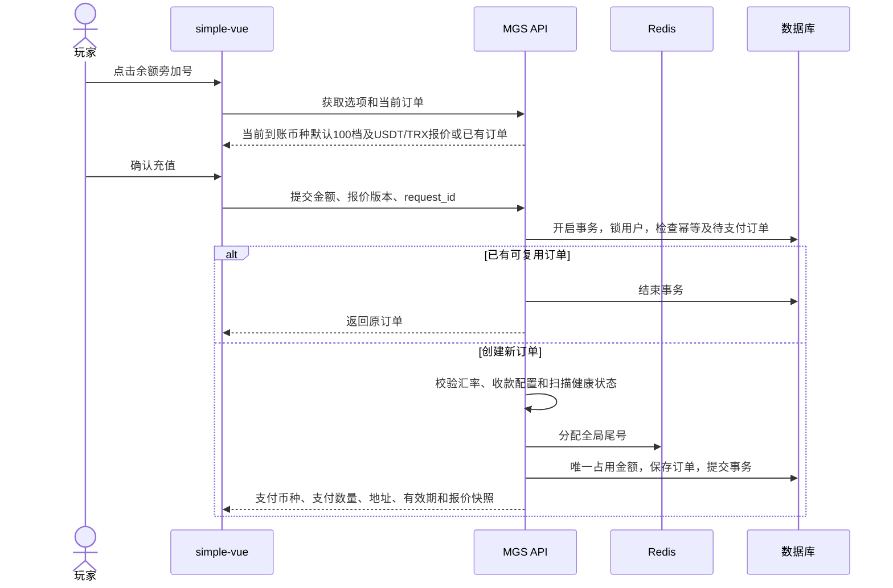
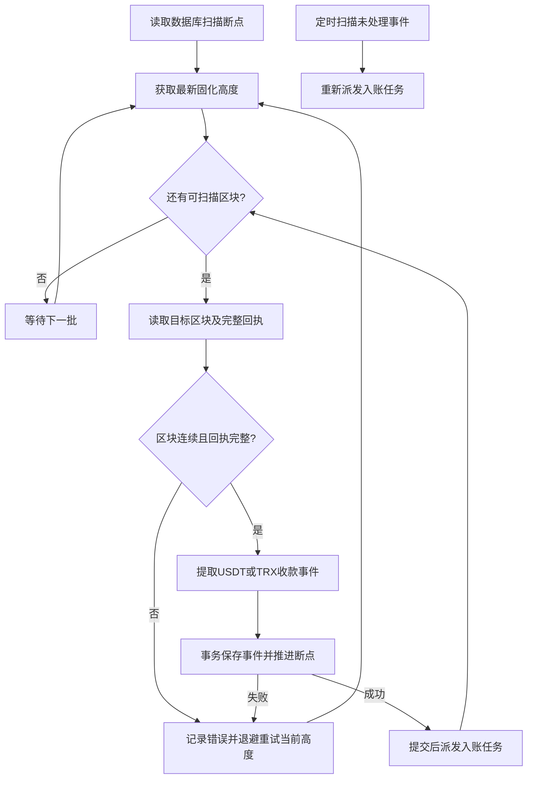
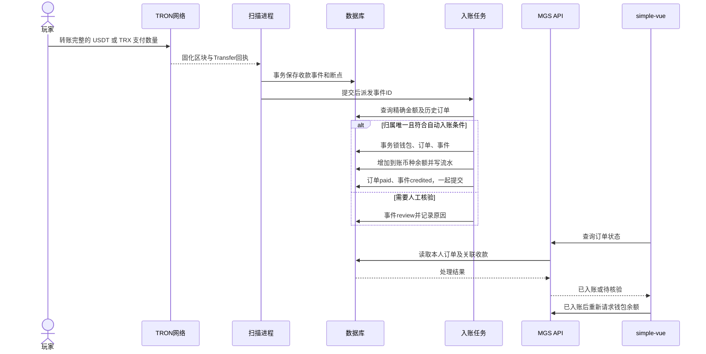

# simple-vue 充值技术方案

> 当前实现：配置、报价刷新、下单/查询、金额占用和充值弹层。扫块、队列补扫、自动入账、占用释放和后台核验尚未实现；二维码、复制和倒计时交互待补齐。`MGS_RECHARGE_ENABLED` 默认关闭，不能用于真实收款。

## 1. 功能

- 余额右侧增加 `+`，点击打开充值弹层，适配手机、明暗主题和现有语言。
- 所有支持的充值币种共用默认档位：`10、20、50、100、200、300、500、1000、2000、5000、10000、50000、100000`，默认选中 `100`。档位由服务端统一定义，金额单位为当前充值币种。
- 使用 TRON 主网收款：USDT 为 TRC20 代币，TRX 为原生币。业务支付方式沿用 `trc20` 编码；到账币种为已开放的钱包币种，例如 `INR`、`USD`。
- 本期完成下单、区块扫描、自动入账、订单查询、后台充值记录和异常收款核验。
- 初始余额仍为零；创建订单不加余额，确认收款后向对应币种钱包增加所选金额。暂不做赠送、活动、提现、链上退款和归集。

## 2. 充值弹层

| 阶段 | 展示与操作 |
|---|---|
| 选择金额 | 默认选中当前到账币种的 100 档，展示各支付币种的预估支付数量；切换档位不下单、不占用尾号 |
| 确认充值 | 服务端校验最新报价，创建订单并返回支付币种、支付数量和报价快照 |
| 等待付款 | 展示订单号、到账币种及金额、支付币种及数量、TRC20 网络、地址二维码、复制按钮和倒计时 |
| 已入账 | 展示成功状态，重新请求 `/api/wallet` 更新对应币种余额 |
| 已过期 | 停止展示可付款二维码，保留订单信息；提示已转账用户等待核验，不重复付款 |
| 待核验 | 已关联的异常收款展示“付款待核验”；不宣称到账成功 |

- 有未过期订单时直接恢复该订单，锁定金额选项；关闭弹层不取消订单。刷新和多标签页使用同一浏览器账户恢复。
- 弹层打开、页面可见且订单待支付时每 5 秒查询。关闭或页面隐藏后停止，重新打开立即查询。
- 保存最近订单号，恢复页面时检查其最终状态。过期、待核验订单允许手动查询；后台入账后刷新余额也能看到结果。
- 提示：“仅支持 TRC20 网络，请按所选支付币种和完整支付数量转账，手续费由付款方承担。”二维码只编码收款地址，金额单独复制。
- 倒计时按接口 `server_time` 校准。没有“我已付款即到账”操作，浏览器不能修改订单状态。
- 浏览器凭证仍用于访问账户，提示用户保留浏览器数据；清除数据不会自动找回账户。

### 2.1 订单状态

订单状态与链上收款状态分开维护：

| 订单状态 | 含义 | 可进入状态 |
|---|---|---|
| `pending` | 已下单，等待付款 | `paid`、`expired`、`review`、`closed` |
| `expired` | 到期时未完成自动入账 | `paid`、`review` |
| `review` | 有收款但无法自动确认归属或金额 | `paid`、`closed` |
| `paid` | 已完成钱包入账 | 终态 |
| `closed` | 管理员确认不再处理 | 终态 |

`expired` 不代表付款无效。若后来发现的区块时间仍在订单有效期内，按原订单自动入账；超时、少付、多付、金额复用或归属不明时进入 `review`。只有余额事务成功提交后，订单才能变为 `paid`。

收款事件独立维护：`pending → credited / review`；人工核验后 `review → credited / ignored`。`ignored` 可由管理员恢复为 `review`，`credited` 不可撤销。订单和事件的到账状态在同一事务提交。

## 3. 汇率与应付金额

### 3.1 每日汇率与支付报价

到账币种的法币或稳定币汇率只读复用 `mg_exchange_rates`，订单、资金和统计使用 MGS 表。现有快照基准为 USD，“今日”沿用快照的 **UTC 日期**，前端展示汇率日期。

```text
到账币种为 INR：usd_per_unit = 1 / rate_json.INR
到账币种为 USD：usd_per_unit = 1
其他币种：       usd_per_unit = 1 / rate_json[currency_code]

currency_code 为入账币种，例如 INR；USD 作为快照基准币种，汇率为 1。
usd_per_unit 的单位：USD / 到账币种
```

`USDT` 按 1 USD 计价；`TRX` 不使用静态汇率，使用 OKX 公共行情接口的 `TRX-USDT` 现货最新价。OKX 行情服务定时刷新并保存 UTC 时间、交易对、价格、来源和请求时间；报价过期或接口异常时暂停 TRX 新下单，不使用旧报价。

没有当日到账币种快照或有效汇率时暂停该币种新下单，不使用旧日汇率。已有订单继续按下单报价收款。

到账币种快照固定选择 `source=currencyapi`、`base_currency_code=USD`。OKX 只读行情使用 `GET /api/v5/market/ticker?instId=TRX-USDT`，充值请求不访问外部汇率源，只读取最近有效快照。

订单保存到账币种汇率、支付币种行情、UTC 日期、来源更新时间、换算值，以及 `pricing_policy=exchange_snapshot / usd_parity / okx_trx_usdt`。报价变化需重新确认，订单创建后不重算。

### 3.2 计算

```text
pay_usd         = USDT取1；TRX取OKX的TRX-USDT价格
target_usd      = 所选到账金额 × usd_per_unit
pay_base_amount = 四舍五入(target_usd / pay_usd, 2)
amount_suffix   = 全局分配的 1～99
pay_amount      = pay_base_amount + amount_suffix / 10000

USDT：23.23 + 0.0001 → 23.2301 USDT
TRX：  23.23 + 0.0001 → 23.2301 TRX
```

- PHP 8.4 使用 BCMath 和 `bcround(..., 2, RoundingMode::HalfAwayFromZero)`。金额通过字符串传输，前端只展示，不计算应付金额。
- USDT 与 TRX 均按 TRON 链上 6 位精度保存和比较，例如 `23.230100` 等于 `23.2301`，`23.230101` 不相等，禁止先四舍五入再匹配。
- 对应币种钱包只增加所选档位金额；识别尾数不再兑换入账。充值和尾数都不计入游戏 GGR。

### 3.3 尾号与金额占用

Redis 全局计数器 `ForeverMgsRechargeSuffix`，值按 `01 → … → 99 → 01` 循环，通过 Lua 原子分配，无 TTL。订单重试不重新分配，允许跳号。

数据库用 `网络 + 支付币种 + 合约（TRX为空）+ 收款地址 + 四位支付数量` 的摘要生成 `amount_match_key`。唯一索引防止同时占用；冲突取下一尾号，最多尝试 99 次。Redis 故障不新建订单，重建后仍由数据库防重。

订单有效期默认 **15 分钟**。待支付订单始终占用金额；已支付、过期或关闭后保留 **24 小时**，随后清空占用键，原订单及金额历史永久保留。待核验且已关联订单的金额暂不释放；恢复核验不抢占已经释放给其他订单的金额。

同一地址、同一基础金额最多有 99 个占用槽。循环和隔离期只能避免当前订单撞单，不能识别很久以后按旧金额转来的钱：

- 自动匹配同时检查付款发生前的全部同地址、同金额历史订单，不仅查最近 99 条或当前待支付订单。
- 同一组合曾分配给其他订单，无法仅靠金额确定归属，转人工核验；不能默认给最新订单入账。
- **反复复用同一金额后，人工核验会增多。** 本期保留四位金额方案；若要求长期高并发、全部自动到账，应另行改为每单独立收款地址或有唯一支付单号的通道。

## 4. 下单接口

沿用 `/api` 和浏览器 Bearer 凭证，用户从凭证读取。统一响应 `{code,message,data}`，金额为字符串，时间为 UTC ISO 8601 字符串。

| 方法 | 路径 | 内容 |
|---|---|---|
| GET | `/api/recharges/options` | 到账币种、默认档位、USDT/TRX 各档预估支付数量、报价日期、`quote_key`、支付方式、充值可用状态 |
| POST | `/api/recharges` | 传 `request_id`、`currency_code`、`recharge_amount`、`pay_currency_code`、`quote_key` 创建订单 |
| GET | `/api/recharges/current` | 返回 `data.order`，无当前订单时为 null |
| GET | `/api/recharges/{order_no}` | 本人订单及关联收款处理状态，包含 `server_time` |

`options/current` 传到账币种和支付类型，例如 `currency_code=INR&pay_currency_code=TRX`。服务端校验到账币种和支付币种是否开放；共用档位不代表开放所有组合。静态路由优先于 `{order_no}`。客户端不能指定用户、汇率、尾号、收款地址或最终支付数量。

- `quote_key` 为币种、报价、汇率政策及收款配置的版本摘要。创建时重算校验，不新增报价表。
- 每次确认生成一个 `request_id`，超时重试继续使用。相同用户、请求号及参数返回原订单，包括已结束订单；参数不一致则拒绝。
- 创建事务锁定用户行，同一用户、到账币种只保留一笔未过期待支付订单；不同请求号的新单提示先处理原订单，通过 `current` 恢复。
- 用户级下单限流只作用于创建接口，重试原订单及查询不消耗新单额度，避免反复占满尾号。



## 5. TRON 区块扫描

### 5.1 进程与断点

新增 Webman 自有进程 `mgs.tron-scan`，`count=1`，随 `mgames.service` 启停，使用默认事件循环。单次定时器串行执行有界扫描批次，避免定时器重入；扫描不放在 HTTP 请求或分钟级定时任务中。

- 读取节点 **最新已固化区块**，从数据库 `next_block_number` 按高度连续扫描。只有已固化区块可以产生可入账事件，不用“最新高度减固定数量”代替固化确认。
- 读取固化区块及其完整交易回执；以 Solidity 接口获取固化高度和区块。批量回执可使用 `/wallet/gettransactioninfobyblocknum`，但只能用于已核对固化区块的高度，必须核对交易归属及回执完整性。
- 检查区块高度、区块哈希和父区块连续性。有智能合约交易但回执缺失、不完整或解析失败时，当前区块不得完成。空区块正常推进。
- **保存该区块所有相关收款事件与推进断点在同一事务内完成。** 入账在事务外单独调度，钱包繁忙不阻塞扫块。
- 重启从断点继续，落后时连续追赶，不直接跳最新高度；单批限制区块数量和执行时间，批次间让出执行权。
- 节点超时、限流或数据库异常时保留当前高度，退避重试；持续失败保留错误信息，不因重试次数耗尽而跳过区块。
- Redis 扫描锁用于避免多实例同时工作，按批次申请、续期、校验持有者并比较 Token 释放；数据库断点加行锁并核对期望高度，旧进程不能覆盖新断点。

首次启用先初始化数据库断点，再开放充值。无历史订单时从当前固化高度开始，并保存前一区块哈希作为连续性校验起点；存在历史订单而断点丢失时停止新下单，按最早需核对订单确定补扫起点，不擅自从最新区块重置。

提供 `php webman mgs:tron-scan --from=<高度> --to=<高度>` 补扫命令。命令只校验范围并投递补扫消息，不在命令进程内长时间请求节点：

1. 按固定批量把高度范围拆成连续的小区间，向 `mgs_tron_backfill` 队列投递消息；消息只携带网络、起止高度和补扫批次号。
2. 消费者逐个高度读取已固化区块，复用实时扫描的区块校验、Transfer 解析和收款事件落库逻辑；每个区块成功落库后确认该消息，异常则按队列重试，不跳过当前高度。
3. 补扫事务只写 `mgs_recharge_transfers`，不写 `mgs_chain_scan_states.next_block_number`、`last_block_hash` 等主扫描断点，也不覆盖实时扫描进度。
4. 命令和消费者都使用 `网络 + 高度范围 + 批次号` 做投递幂等；同一区块允许重复读取，事件依靠 `(network_code, transaction_id, event_type, event_index)` 唯一键落库，不重复入账。
5. 补扫发现事件后，提交事务再投递入账任务；入账仍复用同一匹配和钱包事务，不能因为补扫消息重复而增加余额。

补扫可以与实时扫描并行，但同一网络的区块请求受限流和并发配置约束；补扫失败只影响该批次，后台展示批次进度、最后错误和重试次数。补扫不改变主扫描健康状态，除非它补齐了历史订单所需事件。区块可重复扫描，不能重复入账。

### 5.2 TRON 收款识别

按支付币种分两路识别，网络始终为 TRON 主网：

1. `USDT`：验证交易成功、回执所属区块正确，核对指定 USDT 合约和 `Transfer(address,address,uint256)` 签名；从日志读取转入地址和整数金额，兼容 `transferFrom`、合约代付和批量转账。
2. `TRX`：验证原生 TRX 成功转账的 `contractData.to_address`、`owner_address` 和 `amount`，只接受转入配置收款地址的交易；合约调用里的 TRX 不按普通转账重复识别。
3. 两路金额都用字符串处理并换算为 6 位最小单位，禁止 `hexdec` 转浮点或手写密码学；零金额、其他代币、失败交易不计入充值。
4. 收款唯一键为 `(network_code, transaction_id, event_type, event_index)`。TRX 使用 `native + 原始合约下标`，USDT 使用 `trc20 + 原始日志下标`，避免不同来源的序号碰撞。

扫描地址集合包含当前配置地址和历史订单中的收款地址；改地址不漏掉旧地址迟付。订单保存地址、合约快照，不随配置修改。

### 5.3 扫描流程



提交后派发失败不回滚断点：数据库事件仍是 `pending`，定时任务重新派发，不能把 Redis 队列当作唯一收款记录。

## 6. 匹配与入账

### 6.1 自动匹配条件

事件已固化，且网络、支付币种（及 USDT 合约）、收款地址、6 位精确金额一致。按**区块时间**判断 `create_time ≤ block_time ≤ expire_time`，不用交易创建时间或抓取时间替代付款时间。

只有一笔符合条件的未入账订单，且不存在付款前已创建的其他同组合历史订单，才自动入账。订单已被过期任务标记 `expired`，但实际付款在有效期内，仍可按原订单入账。已关闭订单、停用用户和有歧义的收款转人工。

| 情况 | 处理 |
|---|---|
| 同一链上事件重复扫描、重复消费 | 返回原处理结果，不再加余额 |
| 按时精确付款，扫描或确认延迟 | 按原订单自动入账 |
| 超时付款、金额历史复用、多个候选订单 | `review`，人工核实归属 |
| 少付、多付、拆分付款、无对应订单 | `review`，不拼凑金额或按接近金额自动归属 |
| 已入账订单又收到一笔付款 | 新事件单独留存并转核验，不覆盖原付款 |
| 钱包锁冲突、数据库临时故障 | 事件保留 `pending` 并重试；技术故障不冒充人工核验 |

### 6.2 入账事务

自动到账和后台核验共用一个入账方法，复用 `LockMgsUserWallet(user_id, currency_code)`。事务前准备好对应月份流水表，资金事务内不执行 DDL。

数据库固定按 **钱包 → 充值订单 → 收款事件** 加行锁，再次校验事件及订单状态、匹配信息和用户状态：

1. BCMath 增加 `recharge_amount`，钱包 `version + 1`。
2. 写 `mgs_bills_YYMM`，`type=recharge`、`direction=1`、`transaction_id=recharge:{order_no}`，记录前后余额；`bet_no/game_id` 为空。
3. 订单保存实收金额、支付事件唯一键、交易号、流水号、实际付款时间和入账时间，状态改为 `paid`。
4. 收款事件绑定订单并改为 `credited`，整个事务一起提交；任一步失败全部回滚。

流水月份按入账时的 UTC 月份确定，跨月幂等由订单和收款事件的全局唯一键保证，不依赖扫描最近几个月流水。充值不参与下注、派奖、GGR 或游戏服务费统计。



## 7. 数据表

新增三张单表：充值订单、链上收款、扫描断点。只有钱包流水沿用月表，充值订单不提前分表。字段必须写 COMMENT；时间统一 UTC `DATETIME(3)`，金额统一 `DECIMAL`。

### 7.1 `mgs_recharge_orders`

| 字段 | 类型 | 含义 |
|---|---|---|
| `id / order_no` | BIGINT UNSIGNED / VARCHAR(40) | 主键、订单号；复用 `mg_no('MR')` |
| `user_id / wallet_id` | BIGINT UNSIGNED | MGS 用户、钱包关联 |
| `request_id` | VARCHAR(64) | 下单幂等请求号 |
| `currency_code / recharge_amount` | VARCHAR(16) / DECIMAL(24,8) | 入账币种、应入账金额 |
| `pay_type / provider_code / pay_method` | VARCHAR(24/32/32) | 本期 `crypto / tron / trc20`；后续普通充值可使用 `normal / 通道编码 / upi` |
| `pay_currency_code` | VARCHAR(16) | `USDT` 或 `TRX` |
| `pay_base_amount / pay_amount` | DECIMAL(24,8) | 支付币种两位基础数量、加尾数后的最终支付数量 |
| `amount_suffix` | TINYINT UNSIGNED NULL | 尾号 1～99；普通充值为空 |
| `received_amount` | DECIMAL(24,8) NULL | 核实的实收付款金额，付款币种口径 |
| `exchange_rate_id / exchange_rate_value` | BIGINT UNSIGNED NULL / DECIMAL(36,18) | 到账币种汇率快照ID、每单位到账币种对应的支付币种数量 |
| `rate_snapshot` | JSON | 到账币种汇率、支付币种、OKX交易对/价格、UTC日期、来源和计价政策 |
| `network_code` | VARCHAR(32) NULL | 本期 `tron_mainnet` |
| `token_address / receive_address` | VARCHAR(128) NULL | 合约、收款地址快照，区分大小写 |
| `amount_match_key / amount_release_time` | CHAR(64) NULL / DATETIME(3) NULL | 唯一占用键、UTC最早释放时间 |
| `payment_key / transaction_id` | CHAR(64) NULL / VARCHAR(128) NULL | 成功支付事件唯一键、链上或通道交易号 |
| `bill_no` | VARCHAR(40) NULL | 成功入账流水号 |
| `status` | VARCHAR(16) | `pending / expired / review / paid / closed` |
| `expire_time / paid_time / credited_time` | DATETIME(3) | UTC到期、实际付款、钱包入账时间，后两项可空 |
| `remark` | VARCHAR(255) NULL | 处理说明 |
| `create_time / update_time / delete_time` | DATETIME(3) NULL | 框架时间字段，不提供删除充值订单操作 |

唯一索引：`order_no`、`(user_id, request_id)`、`amount_match_key`、`payment_key`。后两项未占用时为 SQL NULL。付款键按网络、交易号、事件类型、原始下标生成；普通充值按通道和交易号生成。

查询索引：`(user_id, create_time, id)`、`(user_id, currency_code, pay_type, status)`、`(status, expire_time)`、`amount_release_time`、`credited_time`，以及网络、合约、地址、金额的组合索引。

### 7.2 `mgs_recharge_transfers`

| 字段 | 类型 | 含义 |
|---|---|---|
| `id / recharge_order_id` | BIGINT UNSIGNED / BIGINT UNSIGNED NULL | 收款记录主键、已核实关联订单 |
| `network_code / transaction_id / event_index` | VARCHAR(32) / VARCHAR(128) / INT UNSIGNED | 网络、交易哈希、回执日志下标 |
| `event_type` | VARCHAR(16) | `native` 原生转账；`trc20` 代币日志 |
| `block_number / block_hash` | BIGINT UNSIGNED / VARCHAR(64) | 固化区块高度、哈希 |
| `token_address / from_address / receive_address` | VARCHAR(128) | 合约、付款地址、收款地址 |
| `currency_code / amount` | VARCHAR(16) / DECIMAL(24,8) | 实际支付币种（USDT/TRX）和收款金额，保留6位 |
| `status / reason` | VARCHAR(16) / VARCHAR(255) NULL | `pending / credited / review / ignored`；处理原因 |
| `block_time / detected_time / processed_time` | DATETIME(3) | UTC区块时间、发现时间、完成处理时间；最后一项可空 |
| `reviewed_by / reviewed_time / remark` | BIGINT UNSIGNED NULL / DATETIME(3) NULL / VARCHAR(500) NULL | 管理员、UTC核验时间、处理依据 |
| `data` | JSON | 该事件及必要回执证据，不保存整块无关交易 |
| `create_time / update_time / delete_time` | DATETIME(3) NULL | 框架时间字段，不提供删除收款记录操作 |

唯一索引：`(network_code, transaction_id, event_type, event_index)`。地址采用 ASCII 二进制排序规则，区分大小写。一个事件只能入账一次；一个订单可关联多笔核验记录，但仅允许一笔充值入账。

### 7.3 `mgs_chain_scan_states`

| 字段 | 类型 | 含义 |
|---|---|---|
| `id / network_code` | BIGINT UNSIGNED / VARCHAR(32) | 主键、唯一网络编码 |
| `start_block_number / next_block_number` | BIGINT UNSIGNED | 起扫高度、下一待扫高度 |
| `last_block_hash / last_block_time` | VARCHAR(64) NULL / DATETIME(3) NULL | 上一完整落库区块哈希、UTC区块时间 |
| `solid_block_number / solid_block_time` | BIGINT UNSIGNED NULL / DATETIME(3) NULL | 最近观测到的固化头高度、UTC区块时间 |
| `last_success_time / heartbeat_time` | DATETIME(3) NULL | UTC最近成功推进、最近进程心跳 |
| `last_error` | VARCHAR(500) NULL | 最近异常摘要，不含API Key |
| `create_time / update_time / delete_time` | DATETIME(3) NULL | 框架时间字段，正常运行不删除断点 |

API 主键分别叫 `mgs_recharge_order_id`、`mgs_recharge_transfer_id`，关联用户与钱包叫 `mgs_user_id`、`mgs_wallet_id`。内部占用键和支付幂等键不返回浏览器。

## 8. 后台核验与运行配置

### 8.1 后台

| 方法 | 路径 | 用途 |
|---|---|---|
| GET | `/mgs/recharges`、`/mgs/recharges/{id}` | 充值订单列表、详情和关联收款/流水 |
| GET | `/mgs/recharge-transfers`、`/mgs/recharge-transfers/{id}` | 链上收款及待核验列表、证据详情 |
| POST | `/mgs/recharge-transfers/{id}/credit` | 核验后关联订单并入账，传订单号和处理依据 |
| PUT | `/mgs/recharge-transfers/{id}/review` | 保存核验备注或标记非充值收款，不修改金额和余额 |
| GET | `/mgs/recharge-scan` | 扫描高度、固化高度、落后量、心跳及错误 |

列表支持订单号、用户、状态、币种、日期及交易哈希等相关筛选。分别提供查看权限和 `app:mgs:recharge:credit`、`app:mgs:recharge:review` 操作权限；普通 MGS 运营角色默认只读，资金操作单独授予。

人工入账也必须对应已固化真实收款、未入账订单和精确金额，只允许解除超时或归属核验限制，不能用此入口任意加余额。付款截图或公开 TXID 本身不能证明账户归属，需核实付款方及目标账户并记录依据。

少付、多付、拆分和退款先留在待核验列表，本期不提供任意金额补账或链上退款。`ignored` 仅表示已核实非充值，不删除资金证据；若需恢复核验，记录管理员及原因。已入账记录不可通过核验接口撤销。核验过程接入管理操作日志，记录变更前后状态、订单关联和处理依据。

### 8.2 配置与运行

- 首版开关、到账币种、收款地址、节点和行情参数统一读 `.env`。支付币种固定 USDT/TRX，有效期 15 分钟。后续后台配置另行接入，不维护两份配置源。

`.env` 配置：

| 变量 | 作用 |
|---|---|
| `MGS_RECHARGE_ENABLED` | 默认 `false`；链上确认与入账完成验证后才可开启 |
| `MGS_RECHARGE_CURRENCIES` | 逗号分隔的到账币种，如 `INR,USD`；缺省沿用 `MGS_DEFAULT_CURRENCY` |
| `MGS_RECHARGE_TRON_RECEIVE_ADDRESS` | TRON 主网收款地址；USDT、TRX 共用，可更换但旧订单仍按快照扫描 |
| `MGS_RECHARGE_TRON_USDT_CONTRACT` | 主网 USDT 合约地址，默认 `TR7NHqjeKQxGTCi8q8ZY4pL8otSzgjLj6t` |
| `TRON_URL` | TRON Solidity/节点接口地址，默认 `https://api.trongrid.io` |
| `TRON_API_KEYS` | 多个节点只读 API Key，逗号分隔；请求随机选一个 |
| `OKX_BASE_URL` | OKX 公共 API 地址，默认 `https://www.okx.com` |
| `OKX_TICKER_TTL` | 行情有效秒数，默认 120；同时检查行情源时间，过期只停用 TRX |

收款地址只保存公钥地址，不需要私钥。OKX 行情任务定时读取 `TRX-USDT` ticker，保存价格、采集时间和有效期；不使用交易 API，也不保存 OKX 密钥。USDT 按 1 USD 计价。

`MGS 充值报价` 任务每分钟刷新，默认停用；可用 `php webman mgs:recharge-price` 单次刷新。查询和下单只读有效缓存，OKX 故障不影响 USDT 报价。修改环境配置后重启服务。

地址、合约、节点未配置，扫描未初始化，心跳超过 2 分钟，或扫描落后固化头超过 2 分钟时暂停新下单；旧订单查询、扫描和入账继续运行。
- 正式收款前核验 TRON 主网官方 USDT 合约、节点固化接口、批量回执能力和限额。系统只监控公开收款地址，不需要钱包私钥。
- 每分钟执行订单过期、到期金额释放和 `pending` 收款补派发；异常收款保留在后台，不因队列重试耗尽而删除。补扫使用独立的 `mgs_tron_backfill` 消费队列，实时扫块和补扫互不推进对方断点。
- Redis Key 集中到 `RedisKey.php`：`ForeverMgsRechargeSuffix`、`LockMgsTronScan`、用户下单限流键及告警限流键；钱包锁沿用现有定义。扫描断点以数据库为准。
- 扫描持续落后、节点限流、入账任务堆积和待核验新增均记录结构化日志并在后台提示；不新增未经配置的外部消息发送。
- 日志按天轮转保留7天，成功扫块按分钟汇总；只记录自有收款和错误摘要，不逐块打印完整回执，防止磁盘持续增长。

## 9. 实现与验收

业务代码放 `server/app/`：充值 Controller、Logic、Validate 和 Model；扫描进程放 `app/process/`，TRON解析放 MGS 业务服务，入账任务使用现有队列。前端独立充值弹层，后台复用现有列表、详情和权限组件，不改 SaiAdmin 产品源码。

建表统一更新 `schema.sql`；菜单、配置、任务和精确角色权限更新 `system.php`；路由写 `route.php`；流水模板注释、类型字典、API类型和全部语言包同步补齐。后续普通充值沿用订单和钱包入账规则，增加通道实现，不复制一套钱包逻辑。

| 验收项 | 必须覆盖 |
|---|---|
| 前端 | 默认100、十三档、多币种共用档位、手机、主题、语言、关闭与刷新恢复、轮询停止、对应币种余额更新 |
| 汇率 | 各到账币种换算、USD基准汇率为1、USDT按1 USD、TRX使用OKX行情、行情过期、无当日汇率、跨UTC日、报价变更、四舍五入边界 |
| 金额 | 01/09/99、尾号循环、并发占用、99槽耗尽、Redis重建、6位链上金额精确匹配 |
| 订单 | 并发、多标签、超时重试、参数冲突、越权查询、禁止客户端确认付款 |
| 扫描 | 空块、回执缺失、节点超时/限流、停机追赶、断点重启、重复补扫、父哈希异常 |
| 事件 | TRX原生转账、transferFrom、批量Transfer、同TX多事件、approve、失败交易、假USDT、旧地址迟付 |
| 入账 | 重复消费、事务回滚、跨月、下注并发、迟发现但按时付款、历史金额复用转核验 |
| 后台 | 核验权限、操作留痕、不能重复入账、不能用少付款任意加余额、异常收款不丢失 |

开发完成执行 PHP 语法、金额/事务/并发测试、前端类型检查与构建；数据库执行升级预览、升级及 `DbUpgradeSmoke`，验证空库安装与重复升级无差异。

上线前配置收款地址、节点及只读 API Key，初始化扫描，确认能持续追到固化头，再开放充值。用受控钱包完成一笔真实小额TRC20充值，核对“链上事件 → 充值订单 → 对应币种余额 → MGS流水”，再重放事件验证余额不变。
