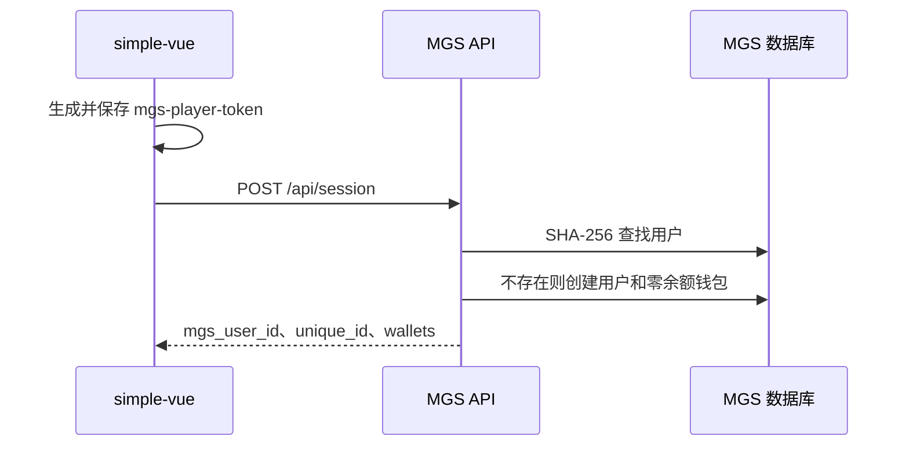
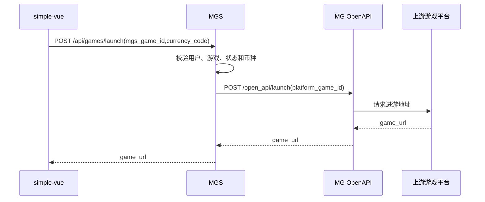

# simple-vue 自营大厅技术方案

## 1. 功能

- Vue 3 独立应用，放在仓库根目录 `simple-vue/`。
- 提供品牌列表、游戏列表、搜索、分类、语言、主题、PWA 和游戏播放。
- 首次访问自动创建 MGS 用户，默认余额为 `0`，不显示密码弹窗。
- 浏览器永久保存用户 `unique_id`；刷新或更换游戏继续使用同一用户。

## 2. 用户标识

`mgs_users.id` 是数据库主键；对外字段统一使用 `mgs_user_id`。用户编号统一为 `unique_id`，整套系统直接复用现有 `id2big/big2id` 算法，数字字典、偏移量和首位规则全部保持不变：

```php
// 编码：id2big($id)
// 解码：big2id($unique_id)
```

禁止为 MGS 另设字典或改动算法。数据库增加 `mgs_users.unique_id BIGINT UNSIGNED UNIQUE`，由服务端按 `mgs_users.id` 生成；不再使用 `user_no`。现有 MG、商户、游戏和 MGS 相关 ID 的编码、解析都调用同一组函数。

迁移时将原 `user_no` 按原用户 `id` 重新计算为 `unique_id`，校验全量可逆和唯一后再移除旧字段；不修改全局算法，也不改动其他历史编码。

浏览器另保存随机 `mgs-player-token`，服务端只保存 SHA-256 摘要，用于识别当前浏览器。前端不能使用 `unique_id` 查询其他用户。

## 3. 接口

| 方法 | 路径 | 说明 |
|---|---|---|
| `POST` | `/api/session` | 创建或恢复用户，创建零余额钱包 |
| `GET` | `/api/brands` | 品牌列表、分类统计和数量 |
| `GET` | `/api/games` | 游戏列表、筛选、搜索和分页 |
| `POST` | `/api/games/launch` | 校验状态后进入游戏 |
| `GET` | `/api/user` | 当前用户信息 |
| `GET` | `/api/wallet` | 当前用户余额 |

`/api/mgames/{balance|bet|win|cancel}` 仅供 MG 回调；`/open_api/*` 仅供 MGS 服务端调用 MG；浏览器不调用这两组接口，也不使用 `/operation/balance`。

统一响应：`{"code":200,"message":"success","data":{}}`。金额为字符串；关联主键使用 `mgs_user_id`、`mgs_game_id`、`mgs_brand_id`、`mgs_wallet_id`；时间使用 `create_time`、`update_time`。

## 4. 自动建号流程



- 凭证放 `Authorization: Bearer` 请求头，不放 URL 或日志。
- `/api/session` 必须幂等；重试不能重建用户或重置余额。
- 清除浏览器数据后视为新用户；不能把认证失败自动换成新用户。
- 创建用户不充值、不赠送余额。

## 5. 品牌列表与游戏列表

`GET /api/brands?currency_code=INR` 返回分类和品牌统计：

```json
{"default_currency_code":"INR","categories":[{"code":"slot","count":10,"available_count":9,"brands":[{"mgs_brand_id":1,"code":"pg","name":"PG","count":10,"available_count":9}]}]}
```

分类为 `slot`、`fish`、`table`、`poker`、`sport`、`other`；未知类型进入 `other`。`GET /api/games` 参数为 `currency_code`、`game_type`、`brand_code`、`keyword`、`page`、`limit`，排序固定 `sort ASC, id DESC`。

游戏字段：`mgs_game_id`、`name`、`names`、`icon_url`、`mgs_brand_id`、`brand_code`、`brand_name`、`game_type`、`currency_codes`、`is_hot`、`is_new`、`status`、`unavailable_reason`。

`mgs_game_id` 对应 `mgs_games.id`；`platform_game_id` 只供服务端映射 MG。游戏列表返回可用和不可用状态，不可用游戏置灰；进游必须再次校验。同步时将 MG 的类型、名称、图标和币种规范化写入 `mgs_games`，WXGAME 当前的 `extra.game_type` 要映射到 `game_type`。

## 6. 进入游戏与余额



- 服务端通过 `mgs_game_id` 查询 `platform_game_id`，禁止混用两个 ID。
- `/api/wallet` 只读取当前用户，不创建用户、不修改余额；无记录按零返回。
- 游戏内扣款、派奖、取消仍走 MG -> MGS `/api/mgames/*` 回调，浏览器不参与资金操作。
- 零余额可以进游；下注余额不足时由钱包回调拒绝。

## 7. 前端与数据库改造

- 复制 `proxy-web` 到 `simple-vue/`，删除 `AccessDialog`、访问密码和 TTL。
- 接入上述 6 个接口，保留播放器全屏、方向切换、刷新、关闭、新窗口和 PWA。
- 本地键统一使用 `mgs-*`：`mgs-player-token`、`mgs-language`、`mgs-theme`、`mgs-lobby-state`。
- 数据库在 `schema.sql` 增加 `unique_id`、`browser_token_hash` 及索引，字段补充 COMMENT。
- 不复制依赖文件夹、构建产物、本地密钥和 Git 元数据。

## 8. 验收

- 新浏览器自动建号，`unique_id` 可逆且唯一，余额为零；刷新、多标签、重试不重复建号。
- 错误凭证、停用用户不能访问钱包或进游，不能通过 `unique_id` 越权。
- 品牌统计、游戏列表、分类、币种、状态、分页和 `sort ASC, id DESC` 正确。
- MG/MGS ID 映射正确，语言、余额和游戏 URL 正常传递。
- 零余额下注失败且不产生负余额；下注、派奖、取消回调和流水正常。
- 完成 PHP 语法、前端测试、类型检查、构建、数据库升级和接口联调后再上线。
