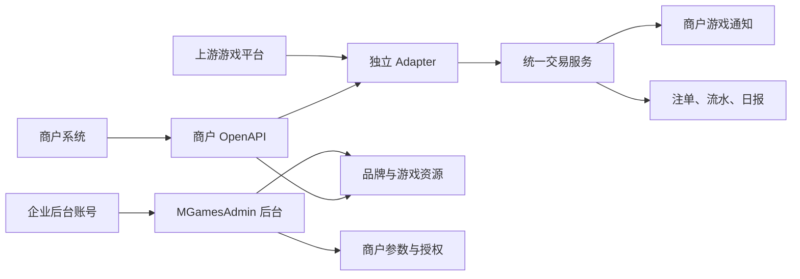

# MG 游戏平台技术文档

## 1. 产品目标

MG（`mgames.im`）是一套连接上游游戏平台和下游企业的游戏聚合系统。平台负责游戏平台接入、品牌与游戏资源、企业后台、商户参数、玩家、进游、资金回调、注单、流水、计费和报表；玩家真实余额仍由商户钱包管理。

首期必须让运营人员顺利完成两条工作链路：

1. MG 管理员同步游戏资源，处理品牌归并，创建企业和商户，配置币种、授权、费率与额度，查询注单和流水。
2. 企业负责人登录同一后台，创建子账号，查看本企业被分配的商户、玩家、注单、流水和报表。

设计原则：

- 使用者看到业务名称和明确操作，不要求理解表结构、上游协议或幂等键。
- 配置表保持单表，只有持续增长的注单和玩家流水按月分表。
- 金额使用十进制字符串、`DECIMAL` 和 BCMath，禁止使用 `float` 计算资金。
- 数据库、接口和结算计算保留原始高精度；后台金额统一显示 2 位小数。平台应收和利润使用四舍五入，商户额度、应付和实际给付使用舍弃法，显示规则不得反向修改账务数据。
- Redis 锁只降低冲突，最终幂等由数据库唯一索引保证。
- 成功流水不可修改或删除，退款和回滚必须新增反向流水。
- 网络超时属于结果未知，必须使用原交易号查询或重试。

## 2. 总体架构



系统有四类入口：

- MG 管理端：企业、商户、统一品牌、品牌资源、游戏资源、授权、玩家、注单、流水和报表。
- 企业管理端：复用同一 MGamesAdmin 登录页和页面，但数据范围固定为所属企业。
- 商户 OpenAPI：游戏列表、进游和 RTP。玩家在首次进游时幂等创建，账单与报表由后台查看或导出。
- 上游回调：每个 Adapter 验证并解析自己的协议，再调用统一交易服务。

## 3. 企业、账号和商户

### 3.1 企业后台账号

`sa_system_user` 是唯一的后台登录账号表。企业负责人和子账号都存入该表；`mg_enterprise_users` 只保存登录账号与企业的关系以及是否为负责人，不保存用户名和密码。

合作流程：

1. MG 管理员创建企业。
2. MG 管理员为企业创建一个负责人账号，同时写入 `sa_system_user` 和 `mg_enterprise_users`。
3. 企业负责人登录后可以创建和停用本企业子账号。
4. 子账号同样写入 `sa_system_user`，账号类型固定为企业子账号，不让创建人手工选择系统角色。
5. 创建子账号时必须选择可访问的商户参数，关系保存到 `mg_enterprise_user_merchants`；负责人默认可访问本企业全部商户。
6. 所有企业侧请求仍在后端校验企业和商户范围，不能只依赖前端隐藏菜单。

一个后台账号首期只属于一个企业。MG 内部管理员不写入 `mg_enterprise_users`，因此拥有全局管理范围。

| 身份 | 主要能力 |
| --- | --- |
| 超级管理员 | 创建企业和商户、配置计费、调整额度、决定平台允许的品牌和游戏、查看全部数据 |
| 企业负责人 | 管理本企业子账号、分配商户范围、维护回调参数、在平台允许范围内上架品牌和游戏 |
| 企业子账号 | 只查看明确分配的商户及其玩家、注单、流水、报表和对接文档 |

后台顶部固定显示当前业务时区、身份和商户参数快捷切换。超管可切换全部商户；负责人可切换本企业全部商户；子账号只能切换已分配商户。超管专属按钮和字段显示小型“超管”标识。

### 3.2 商户参数

企业是组织和数据权限边界，商户是一套对外接入参数。一个企业可以有多个商户，例如正式环境、不同业务线或不同回调地址；数量由 `mg_enterprises.merchant_limit` 限制，只有 MG 管理员能创建商户或提高上限。

`mch_id` 在商户创建后使用 `id2big(mg_merchants.id)` 生成，对外稳定且不可修改。商户和 MG 双向请求首期共用一个 `secret` 签名，密钥可在有权限的后台中回显，数据库使用应用密钥可逆加密，不增加 Access Key、双密钥、版本和历史密钥。签名只对排序后的业务参数和 `secret` 计算 MD5，不引入请求头、nonce、路径和请求体哈希。

创建商户时可以选择另一商户作为来源执行“复制授权配置”，只复制：

- `mg_merchant_brands` 的统一品牌授权。
- `mg_merchant_games` 的单款游戏例外和特殊费率。

不会复制密钥、回调地址、币种额度、玩家、注单、流水或报表。“游戏同步”只表示从上游拉取游戏资源，不用于商户之间复制授权。

### 3.3 钱包模式

首期只开放无缝钱包：MG 不保存玩家余额，每次余额、下注、派奖和取消都同步调用商户通知接口。

`wallet_mode` 保留两种值：

- `1` 无缝钱包，首期可用。
- `2` 转账钱包，暂不允许保存为启用状态。

以后增加转账钱包时新增 `mg_user_wallets`，按 `merchant_id + user_id + currency_code` 保存余额，并增加转入、转出流水类型。Adapter、玩家编号、注单、玩家流水和报表继续复用，不需要重写上游接入层。

## 4. 品牌与游戏模型

### 4.1 两层品牌

品牌必须分为统一品牌和上游品牌资源：

- `mg_unique_brands`：MG 对商户展示和授权的统一品牌，例如 JILI，`code=jili`。
- `mg_game_brands`：某个游戏平台返回的品牌资源，保留游戏平台和上游品牌编码。

示例：

```text
mg_unique_brands
JILI / code=jili

mg_game_brands
WxGame      / provider_brand_code=jili -> unique_brand_id=JILI
GoldenGateX / provider_brand_code=jl   -> unique_brand_id=JILI
```

`mg_games.brand_id` 始终指向 `mg_game_brands.id`，因此每款游戏保留真实游戏平台和上游品牌来源。`mg_merchant_brands.unique_brand_id` 指向统一品牌，商户只需要授权一次 JILI，即可使用所有已映射到 JILI 的上游游戏资源。

### 4.2 游戏不去重

同名游戏来自不同游戏平台时必须保留为不同记录，不按名称、统一品牌或图片去重。假设 WxGame 和 GoldenGateX 都有 JILI 的游戏 A、B，四款都启用且商户已授权统一 JILI，则商户游戏列表展示：

```text
游戏 A · WxGame
游戏 B · WxGame
游戏 A · GoldenGateX
游戏 B · GoldenGateX
```

后续如需自动线路切换，应另建“游戏产品和线路”层；首期不把不同上游游戏强行合并。

### 4.3 品牌同步和归并

同步上游品牌时使用以下规则：

1. 先保存或更新 `mg_game_brands` 品牌资源。
2. 将上游品牌 code 去除首尾空格并转为小写。
3. 如果与现有 `mg_unique_brands.code` 完全一致，立即自动归并，不需要二次确认。
4. code 不一致时不得仅凭相似名称自动归并，状态标记为待归并。
5. 待归并记录只提供两个完成操作：搜索并选择已有统一品牌，或新建统一品牌并立即归并。
6. 不提供“暂不处理”按钮；操作员可以关闭弹窗，但该品牌保持待归并。
7. 名称相似度只用于给出候选建议，不能替代人工决定。

未归并品牌及其游戏仍显示在品牌资源和游戏资源中，但不能通过统一品牌授权进入商户游戏列表。将新上游品牌归并到一个已授权给商户的统一品牌前，界面显示将受影响的商户数和新增可用游戏数。

## 5. 四个业务列表

产品使用以下四个准确名称：

| 列表 | 作用 |
| --- | --- |
| 品牌资源 | 查看每个游戏平台同步到 MG 的原始品牌及归并状态 |
| 游戏资源 | 查看每个游戏平台的原始游戏、币种、状态和能力 |
| 商户授权品牌 | 给商户授权 `mg_unique_brands` 中的统一品牌 |
| 商户授权游戏 | 设置单款游戏例外，不复制整份品牌游戏清单 |

`mg_merchant_games` 只保存例外：单独启用、单独禁用或覆盖费率。没有记录表示“跟随商户授权品牌”。`status` 表示 MG 平台是否允许，`merchant_status` 表示企业是否上架；两者同时为 1 才会生效。`mg_merchant_brands` 使用相同的两层状态。

游戏资源同步必须取得完整结果后才将本次未出现的游戏标记为上游下线，不能因上游请求失败批量下架原有游戏。

四个平台的后台同步统一进入 Redis `game_sync` 队列，接口立即返回排队结果；后台消费者分别调用对应 Adapter。WxGame、AceWin、TADA、GoldenGateX 使用同一套异步流程，不在 HTTP 请求内等待上游完成。

## 6. 市场与币种模式

### 6.1 商户模式

`mg_game_brands.is_gc` 表示品牌资源是否支持美国市场的 SC/GC 钱包模式。它由运营在品牌资源页面开启，不由游戏平台或商户参数直接决定：

- `is_gc=0`：该品牌下的游戏只使用一个普通币种。
- `is_gc=1`：该品牌下的游戏同时支持 SC 和 GC。

商户仍需在币种设置中启用可用币种：普通币种最多一个；SC 可以单独启用，需要使用 GC 时再同时启用 GC。常见美国市场商户会配置 USD、SC、GC 三个币种。最终可用币种是“品牌能力”和“商户已启用币种”的交集。

SC、GC 是美国游戏市场约定的钱包标识，不是国际法定币种：

- SC 是美元价值钱包，财务统计固定按 `1 SC = 1 USD` 处理。
- GC 是只能在游戏内消费的 Gold Coin，没有提现、兑换和结算价值。
- `gc_exchange_rate=10000` 只表示商户充值 1 USD 时发放 10000 GC，用于充值数量和游戏内展示，不能把 GC 换算成美元收入或成本。

`mg_merchant_credits.settlement_enabled` 明确控制某个业务钱包是否参加费用结算，不能用 `rate_value=0` 隐式表达免费。GC 固定为 0，后台不允许修改。

规则：

| 币种 | `settlement_enabled` |
| --- | --- |
| 普通单币 | 1 |
| SC | 1 |
| GC | 0 |

### 6.2 上游双币能力

Tada 原生支持同一代理和同一游戏在玩家请求中区分 SC/GC，MG 同步后在对应品牌资源上开启双币，游戏标记为同时支持 `SC`、`GC`。

WxGame 本身不是原生双币平台。为了服务美国市场，MG 配置两套独立上游账号：

```text
WxGame SC account
WxGame GC account
```

WxGame Adapter 根据进游和回调玩家编号末尾的币种选择对应账号。两套账号共享同一 Adapter 代码，但它们仍是两套独立上游商户参数。

普通市场游戏平台继续使用自身单币配置，不因系统支持 SC/GC 而自动变成双币。

### 6.3 GC 游戏账务

GC 的进游、余额、扣款、派奖、回滚、注单、玩家流水、日报和对账全部正常执行，和其他币种一样写入月表，并用 `currency_code=GC` 区分。

GC 不参与应收应付：

```text
ggr_amount          = 实际 GC GGR
billable_ggr_amount = 0
merchant_fee        = 0
upstream_fee        = 0
```

因此 GC 可以完整追踪游戏消耗、派奖和回滚，但始终不进入汇率换算、应收、应付、成本或利润。`gc_exchange_rate` 只用于计算充值发币数量，任何报表都不能据此赋予 GC 财务价值。

## 7. 数据表

所有业务表使用 `mg_` 前缀；Model 类不使用 `Mg` 前缀。主键使用 `BIGINT UNSIGNED`，对外业务编号不直接暴露自增 ID。

### 7.1 配置和账号表

| 表 | 关键字段与职责 |
| --- | --- |
| `mg_unique_brands` | `code`、名称、多语言、图片、排序、状态；统一品牌 |
| `mg_game_brands` | `platform_code`、`provider_brand_code`、`is_gc`、`unique_brand_id`、`mapping_status`、映射人和时间；品牌资源 |
| `mg_games` | `game_code`、`brand_id`、游戏平台、上游游戏 code、名称、图片、支持币种、RTP、状态 |
| `mg_enterprises` | 企业名称、商户上限、时区、默认语言和状态 |
| `mg_enterprise_users` | `enterprise_id`、`system_user_id`、负责人标记和状态 |
| `mg_enterprise_user_merchants` | 企业子账号可以访问的商户参数；负责人不需要逐条配置 |
| `mg_merchants` | `mch_id`、企业、`callback_url`、密钥、语言、计费方案、IANA 业务时区和状态 |
| `mg_merchant_brands` | `merchant_id + unique_brand_id`，平台允许状态和企业上架状态 |
| `mg_merchant_games` | `merchant_id + game_id`，游戏级双层状态、特殊费率和默认 RTP |
| `mg_merchant_credits` | 商户币种、计费模式、费率、是否结算、可用/预占/待结额度 |
| `mg_users` | `merchant_id + merchant_user_id` 玩家映射，保存可选昵称，不保存密码和余额 |
| `mg_user_game_rtps` | 商户、玩家、游戏、币种的 RTP 覆盖值 |
| `mg_configs` | 使用唯一 `code` 保存非敏感全局业务配置，`type` 只负责后台分组，配置值使用 JSON |
| `mg_exchange_rates` | 每日一条完整汇率快照，保存数据来源和源更新时间 |

`mg_users` 字段少且查询都带商户或主键，首期保持单表，不分表。

`mg_configs` 保持通用但不做复杂配置中心：

| 字段 | 说明 |
| --- | --- |
| `type` | 后台配置分组，例如 `platform`、`currency` |
| `code` | 全局唯一配置编码 |
| `name` | 后台显示名称 |
| `value` | JSON 配置值 |
| `remark` | 给运营人员看的说明 |
| `status` | 是否启用 |

唯一索引为 `code`，普通索引为 `type + status`。平台配置放在 `platform` 分组，代码始终直接按以下 `code` 读取：

| `code` | 值 | 业务说明 |
| --- | --- | --- |
| `platform_currency_code` | 例如 `USDT` | 平台多币种合计的折算币种；不影响商户自己的统计币种和原始金额 |
| `platform_timezone` | 标准 IANA 时区，例如 `UTC` | 平台日报、小时趋势和月度趋势划分日期的平台时区；所有具体时刻仍以 UTC 入库 |

商户趋势不使用 `platform_currency_code`。普通商户使用自己启用的唯一计价币种，美国市场商户使用 USD，SC 按 USD 1:1，GC 不折算。汇总表继续保存实际采用的折算币种快照，避免配置变化后误解历史金额。

`mg_configs` 的读取必须经过 Redis，不允许业务代码在每次请求中直接查询数据库。实现时在主应用新增 `server/app/enum/RedisKey.php`，复用 xindong-server 的结构和规则，只维护 MG 自己的 Key，不修改框架：

- `Lock` 开头、`lock:` 前缀：分布式锁，例如 `LockConfigsRebuild = lock:mg:configs:rebuild`。
- `Forever` 开头、`forever:` 前缀：永久缓存，例如 `ForeverConfigs = forever:mg:configs`。
- `Temp` 开头、`temp:` 前缀：有过期时间的临时数据。
- 三类 Key 在 Enum 中分区连续维护，每个 Key 注明数据类型、用途和完整格式；统一复用过期时间常量与 `format()`。

配置首次读取或缓存丢失时，在重建锁内从数据库加载全部启用配置并原子写入 `ForeverConfigs`。后台修改配置提交成功后必须立即重建整份缓存，不能只等过期；并发请求只会读到修改前或修改后的完整版本，不会读到半份配置。

密钥、Token、数据库地址等敏感配置只允许写入 `.env`，不能进入 `mg_configs`、代码、日志或对外文档。

### 7.2 统一品牌映射字段

`mg_game_brands` 增加：

| 字段 | 说明 |
| --- | --- |
| `unique_brand_id` | 可空；归并后的统一品牌 ID |
| `mapping_status` | 0 待归并，1 相同 code 自动归并，2 人工归并 |
| `mapped_by` | 人工操作管理员 ID；自动归并为空 |
| `mapped_time` | 完成归并时间 |

`mg_unique_brands.code` 全局唯一并统一保存为小写。`mg_game_brands` 继续以 `platform_code + provider_brand_code` 唯一。

### 7.3 注单与玩家流水

注单与玩家流水每月一张：

```text
mg_bets_YYMM
mg_bills_YYMM
```

例如 2026 年 8 月使用 `mg_bets_2608` 和 `mg_bills_2608`。系统保留 `mg_bets_template`、`mg_bills_template` 两张模板表。

`mg_bets_YYMM` 每局一条，保存累计下注、派奖、两类回滚、原始 GGR、计费 GGR、费率、费用、动作计数和 `actions` JSON。`actions` 用于让运营直接看清一局内多次扣款、派奖和退款，但资金事实仍以玩家流水为准。

`mg_bills_YYMM` 每个真实资金动作一条，核心字段保持精简：类型、数据来源、来源交易号、金额、币种、原流水号、幂等键、请求哈希、状态和少量结果数据。

两类月表同时保存：

- `business_date`：按 `mg_merchants.timezone` 计算的商户营业日期，用于商户日报和结算；数据库字段必须使用此注释。
- `platform_date`：按 `mg_configs.platform_timezone` 计算的平台统计日期，用于 MG 综合统计；数据库字段必须使用此注释。

示例：下注 10、派奖 6、下注退款 2：

- 注单一条：下注 10、派奖 6、下注退款 2、GGR 2，`actions` 有三个动作摘要。
- 玩家流水三条：扣款、派奖、退款各一条。

### 7.4 月表创建

每月 1 日计划任务检查并预建当月和未来两个月的注单/流水表。每次业务查询或写入仍先检查目标表；缺表时通过命名锁和 `CREATE TABLE IF NOT EXISTS ... LIKE template` 在请求内创建并继续，不能仅因计划任务漏跑让接口报错。只有数据库真实 DDL 失败时才返回错误。

MG 注单号和玩家流水号统一包含 UTC 创建日期：

```text
BT + YYMMDD + HHmmss + 随机串
BL + YYMMDD + HHmmss + 随机串
```

根据 MG 注单号或流水号查询时，直接截取 `YYMM` 定位 `mg_bets_YYMM` 或 `mg_bills_YYMM`，不查询路由表。日期范围查询先按所选平台或商户时区换算成 UTC 起止时刻，再选择覆盖该 UTC 范围的全部月表，合并排序和分页；一个自然月可能涉及两张 UTC 月表，前端不感知分表。

不再建立 `mg_trade_routes` 或 `mg_trade_indexes`。上游幂等键和对局键直接保存在月表并建立唯一索引：正常回调先查询当前 UTC 月表，未命中时再查询前一个月和前两个月，最多执行三次索引等值查询。退款、回滚和迟到派奖使用相同规则定位原流水或注单。

游戏平台接入约定资金回调和重试窗口不超过三个月。超过窗口的历史异常由人工按上游账单处理，不在每笔正常交易上长期维护一份同量级路由数据。

### 7.5 商户费用与报表

- `mg_merchant_monthly_usages`：按商户币种汇总月度用量和费用。
- `mg_merchant_bills`：记录充值额度、服务费和人工调整，字段包含类型、方向、来源和数据快照。
- `mg_merchant_monthly_bills`：保存阶梯月费账单、计算来源月份、指标值和规则快照。
- `mg_daily_stats`：同时保存 `business_date` 和 `platform_date`，按商户、游戏平台、品牌资源、游戏和业务钱包汇总，可从月表重建。
- `mg_hourly_stats`：平台和商户共用的小时流量趋势。
- `mg_monthly_stats`：平台和商户共用的月度访问趋势，替代原 `mg_merchant_monthly_stats`。

日报和商户费用不是玩家钱包余额。跨月和大范围后台统计只读日报，不扫描全部玩家流水。

`mg_daily_stats` 不额外写一条平台合计记录。每条商户维度汇总同时带两个日期：商户报表按 `business_date` 汇总，平台报表按 `platform_date` 汇总。注单数、流水数可以相加；玩家数跨游戏、品牌或小时会重复，不能直接相加，必须读取对应范围统计或从涉及的注单月表重新去重。不同计价单位的金额必须分开显示或按汇率快照折算，禁止直接相加。

### 7.6 汇率快照

汇率使用独立的 `mg_exchange_rates`，不放入 `mg_configs`：

| 字段 | 说明 |
| --- | --- |
| `rate_date` | 汇率快照日期 |
| `base_currency_code` | CurrencyAPI 返回结果的基准币种，默认 `USD`；与 `mg_configs.platform_currency_code` 不是同一配置 |
| `rate_json` | 当日接口返回的完整汇率 JSON |
| `source` | 数据来源，例如 `currencyapi` |
| `source_update_time` | 数据源声明的 UTC 更新时间；数据库字段必须使用此注释 |
| 审计字段 | `create_time`、`update_time`、`delete_time` |

唯一索引为 `rate_date + base_currency_code + source`。每天 `00:10 UTC` 请求一次 CurrencyAPI；同一天重复执行只更新当天记录，过去日期的快照不修改。超管后台提供“更新今日汇率”，接口失败时不写空记录，保留上一份有效快照并告警重试。

汇率页面每行显示一个快照日期。常用币种列表从 `mg_configs` 的 `currency / exchange_rate_display_codes` 读取，页面直接从 `rate_json` 展开为清晰列；完整 JSON 放在详情中，不为常用币种额外增加数据库字段。

某日汇率缺失时使用之前最近一条有效快照。凡是汇率参与计算且计算结果需要落库，必须同时保存汇率快照主键和当时真正采用的有效换算值，不能只依赖以后关联汇率表回算：

- `exchange_rate_value` 使用 `DECIMAL(36,18)`，`exchange_rate_values` JSON 中的值使用十进制字符串，金额换算继续使用 BCMath。
- `mg_daily_stats` 每行只有一个原始业务钱包，保存 `exchange_rate_id`、`exchange_rate_value`、`platform_currency_code` 和对应的 `platform_*` 折算金额；`exchange_rate_value` 表示 1 单位原始金额可换算多少 `platform_currency_code`。
- `mg_hourly_stats` 一行可能包含多种业务钱包。平台口径行保存 `exchange_rate_id`、`exchange_rate_values` JSON 和 `converted_currency_code`；商户口径只合并自身主计价钱包，SC 按 USD 1:1，GC 排除，不使用外部汇率。
- SC 的有效换算值按 USD 计算，GC 不产生换算值。
- `mg_monthly_stats` 不再次使用汇率计算：平台口径累加日报中的 `platform_*` 折算金额，商户口径累加自身主计价钱包金额。因此不伪造一个代表整月的单一汇率；平台金额需要追溯时查询构成该月数据的日报。

平台日报和平台小时统计按各自 `platform_date` 或 `stat_date` 选择同日期汇率快照；该日期没有快照时才向前取最近一条。这样一个统计时间桶只使用一组汇率，并能由落库的快照 ID 和有效换算值完整复现。

CurrencyAPI 的基准为 USD，若目标统计币种为 USDT：

```text
原币种金额 / rate_json[原币种] × rate_json[USDT]
```

SC 直接视为 USD 参与折算；GC 没有财务价值，完整保留其原始数量，但不调用汇率、不进入 `converted_bet_amount` 及任何平台财务合计。

### 7.7 小时与月度趋势

`mg_hourly_stats` 和 `mg_monthly_stats` 不带 `platform` 前缀，同一张表同时服务超管和商户：

| 字段 | 小时统计 | 月度统计 |
| --- | --- | --- |
| `merchant_id` | `0` 表示平台口径，其他值表示对应商户 | 同左 |
| `timezone` | 生成该行时使用的 IANA 时区快照；平台取 `mg_configs.platform_timezone`，商户取 `mg_merchants.timezone` | 同左 |
| 统计周期 | `stat_date` 为该时区自然日，`stat_hour` 为该时区 0-23 小时 | `stat_month` 为该时区自然月 |
| `active_user_count` | 该小时成功下注的去重玩家 | 该月成功下注的去重玩家 |
| `bet_count` | 成功注单量 | 当月成功注单量 |
| `bet_amounts` | 各业务钱包原始下注额 JSON | 各业务钱包原始下注额 JSON |
| `converted_currency_code` | 平台行取 `mg_configs.platform_currency_code`；商户行取商户自己的主计价币种 | 同左 |
| `converted_bet_amount` | 平台行折算为 `platform_currency_code`；商户行合并自身主计价钱包 | 平台行累加日报折算金额；商户行累加自身主计价钱包 |
| 汇率快照 | 仅平台行保存 `exchange_rate_id + exchange_rate_values`；商户行不使用外部汇率 | 不保存，平台行追溯到日报 |

平台行使用 `mg_configs.platform_timezone`，商户行使用 `mg_merchants.timezone`。同一笔下注会进入一条平台时间桶和一条商户时间桶，因此两类用户看到的 0 点、小时和月份都符合自己的业务时区。`timezone` 随汇总行保存，防止以后修改配置后误解历史周期。

超管和商户都显示两张紧凑图表：

- 流量趋势：当天 24 小时的活跃玩家、注单量和折算下注额折线。
- 月度访问：最近 12 个月的月活玩家、注单量和折算下注额柱状图。

商户只能读取自己的统计行；企业负责人和子账号继续受商户参数范围限制。GC 的玩家和注单可以计入活跃量、注单量，GC 数量只留在 `bet_amounts.GC`，不进入折算下注额。

### 7.8 增量更新原理

这里的“增量”表示只重算受影响的时间桶，不对历史全表反复累计，也不在 Redis 中使用浮点数累加金额：

1. 交易成功后，根据平台时区和商户时区各算出一个受影响的小时键，投递统计刷新任务；相同键合并，只保留一条待执行任务。
2. 消费者把该时间桶换算成 UTC 起止时刻，从涉及的月表重新计算去重玩家、注单量和原始下注额，再用唯一键 `updateOrInsert` 整行覆盖。任务重复执行结果不变。
3. 每 5 分钟主动重算当前小时和上一小时，补偿队列延迟、晚到派奖和回滚；更早的交易发生变化时只刷新它实际影响的旧小时。
4. `mg_daily_stats` 同样只重算受影响的商户日和平台日。当前日滚动更新，日界结束后再完整校准一次。
5. `mg_monthly_stats` 每小时从日报汇总当月注单量与平台/商户各自口径的金额，并从该自然月 UTC 范围涉及的注单月表按索引计算去重玩家；月初完整确认上月。历史月份被回滚影响时，只重算对应月份。

这种方式的成本由“发生变化的小时、日期和月份”决定，不随全部历史数据线性增长；同时任何任务都可重放，不会因为重复消费把金额加两次。

### 7.9 时间与跨时区汇总

所有具体时刻统一以 UTC 写入 `DATETIME` 字段，PHP 默认时区和 MySQL 连接时区都固定为 UTC。企业和商户配置使用标准 IANA 时区，只负责营业日、账期和后台展示转换。

下注发生时同时计算 `business_date` 和 `platform_date`，因此同一 UTC 时刻可能属于商户的今天、平台的昨天。月费任务每小时检查一次，按商户当地月份幂等生成账单。

超管看板默认按 `mg_configs.platform_timezone` 和 `platform_date` 展示全平台；商户看板按 `mg_merchants.timezone` 和 `business_date` 展示。超管选择单个商户时可以切换平台口径或商户营业口径；选择多个商户默认使用平台口径，确保所有商户比较的是同一绝对时间窗口。

`mg_configs.platform_timezone` 上线前确定后应保持稳定。确需修改时，从 UTC 月表重建所有受影响的 `platform_date`、平台日报和平台趋势；不能直接把历史日期标签改成新时区。

`mg_configs.platform_currency_code` 同样应保持稳定。修改后必须使用历史汇率快照重建日报中的 `platform_*` 金额及平台小时/月度趋势；重建完成前后台明确显示“平台统计重建中”，禁止把不同 `platform_currency_code` 的历史金额直接相加。商户原始金额和商户趋势不受此次修改影响。

业务字段命名统一：具体时刻使用 `*_time`，自然日使用 `*_date`，月份使用 `*_month`，审计字段固定为 `create_time`、`update_time`、`delete_time`。不再新增 `*_at`、`*_updated_time` 等混合命名；数据源更新时间统一命名为 `source_update_time`。

所有相关建表 SQL 必须使用以下字段注释，不能只在 PHP 或前端解释：

| 表和字段 | 数据库字段注释 |
| --- | --- |
| `mg_enterprises.timezone` | 企业默认 IANA 时区；仅作为新建商户的默认值 |
| `mg_merchants.timezone` | 商户业务 IANA 时区；用于营业日、月费账期和商户后台时间展示 |
| `mg_bets_*.business_date`、`mg_bills_*.business_date` | 按商户业务时区计算的营业日期 |
| `mg_bets_*.platform_date`、`mg_bills_*.platform_date` | 按 `mg_configs.platform_timezone` 计算的平台统计日期 |
| `mg_daily_stats.business_date` | 商户业务日期；商户报表按此字段汇总 |
| `mg_daily_stats.platform_date` | 平台统计日期；平台报表按此字段汇总 |
| `mg_hourly_stats.timezone` | 当前小时统计行采用的 IANA 时区快照 |
| `mg_hourly_stats.stat_date` | 按本行 `timezone` 计算的自然日 |
| `mg_hourly_stats.stat_hour` | 按本行 `timezone` 计算的小时，范围 0-23 |
| `mg_monthly_stats.timezone` | 当前月度统计行采用的 IANA 时区快照 |
| `mg_monthly_stats.stat_month` | 按本行 `timezone` 计算的自然月，格式 YYYY-MM |
| `mg_exchange_rates.rate_date` | CurrencyAPI 汇率快照对应的 UTC 日期 |
| `mg_exchange_rates.source_update_time` | CurrencyAPI 声明的 UTC 数据更新时间 |
| 所有 `*_time` 及审计时间 | UTC 具体时刻；展示时再转换为平台或商户时区 |

## 8. 计费方案

一个商户参数只能选择一种方案，首期只支持以下两种：

| 方案 | 规则 |
| --- | --- |
| 正 GGR 分成 | `max(ggr_amount, 0) × rate_value`，使用服务费额度控制是否允许新进游和下注 |
| 阶梯月费 | 首月按配置的最低月费收取；次月开始按上月投注额或上月注单量匹配阶梯，最低月费和阶梯均可配置，初始建议值为 1000 U |

```text
ggr_amount = (bet_amount - bet_rollback_amount)
           - (win_amount - win_rollback_amount)

merchant_fee = settlement_enabled
             ? max(ggr_amount, 0) * merchant_rate_value
             : 0
```

负 GGR 原值必须记录，但不会退还已经产生的服务费，也不会自动跨注单或跨期抵扣。双方合同如有其他约定，通过后续人工调整或专门结算规则实现，系统不能擅自生成退费。

正 GGR 分成模式下，费率、`settlement_enabled` 和最终费用在建单时固化到注单，配置修改不影响历史事实；游戏级 `rate_value` 优先于商户币种默认费率。GC 只记录游戏账务和对账，不占用额度、不产生服务费。

阶梯月费模式仍完整记录每局 GGR，但注单费率和服务费为 0，也不因未交月费阻止进游。系统按商户当地月份生成当月账单：商户首次出账固定使用最低月费，之后读取上月统计匹配最高适用阶梯。账单状态为待支付、已支付、已逾期或已减免。

阶梯指标只能选择：

- 月投注额：当月所有未完全取消注单的净下注额。
- 月注单量：当月净下注额大于 0 的注单数。

月活跃玩家仍按当月成功下注去重统计并展示，但不能作为阶梯月费指标，避免通过批量低额账号影响计费档位。

## 9. 交易流程

1. Adapter 验证上游请求并转换为余额、扣款、加款或回滚动作。
2. 从玩家编号得到平台用户、商户和币种。
3. 使用“动作 + 玩家 + 币种 + 上游交易号”生成幂等键。
4. 第一段数据库事务创建或定位注单与玩家流水，计算需要预占的服务费后提交。
5. 使用上游原始 `transaction_id` 同步调用商户通知接口，商户按“接口 + 玩家 + 币种 + 游戏 + 交易 ID”幂等。
6. 第二段数据库事务保存商户结果，更新注单汇总、动作 JSON、额度、商户流水和状态。
7. 成功但未结单时，以 `bet_no` 为唯一消息 ID 覆盖写入 600 秒延迟结单任务；已结单则移除待执行任务。
8. Adapter 将统一结果转换为上游响应。

数据库事务内禁止等待远程 HTTP。余额不足、用户停用等确定拒绝进入失败，不自动重试；超时和连接中断进入结果未知，后台使用原 `transaction_id` 受控重试。

用户冻结或商户暂停时阻止新进游和新下注，但历史派奖、退款和必要回滚必须继续处理。

## 10. 商户接口

### 10.1 商户调用 MG

```text
POST /open_api/games
POST /open_api/launch
POST /open_api/rtp
POST /open_api/bets
```

对外产品和接口说明统一使用“游戏列表”。游戏列表直接带统一品牌；来源不同的同名游戏不会合并。首次进游自动创建玩家，不提供单独用户同步接口；商户可查询注单记录，便于对账和后续扩展转账钱包。

进游请求的 `nickname` 为可选字段，首次进游时写入玩家资料：

```json
{
  "game_id": "goldengatex_63080",
  "user_id": "mgames_demo_002",
  "nickname": "演示玩家 002",
  "currency": "USD",
  "language": "en",
  "back_url": "https://merchant.example/home"
}
```

`/open_api/bets` 按月份查询当前商户的注单记录，返回注单号、玩家、游戏、币种、下注、派奖、回滚、GGR 和结单状态；金额和编号均按字符串传输。

进游和 RTP 请求可传 `currency`。省略时，SC 游戏默认使用 SC，普通单币游戏使用当前可用币种；使用 GC 时必须明确传 `GC`。不传 `user_ids` 的 RTP 请求保存当前商户和游戏的默认 RTP，在玩家下次进游前应用；传逗号分隔的 `user_ids` 时立即设置这些玩家的覆盖 RTP，玩家值优先于游戏默认值。

RTP 下发遵循上游真实生命周期：WxGame 在首次 `verify` 响应中接收玩家 RTP；GoldenGateX 等平台在进游会话创建玩家后立即调用设置接口。OpenAPI 对商户保持同一个 RTP 请求模型，差异只留在 Adapter 内。

### 10.2 MG 调用商户通知

```text
POST {callback_url}/balance
POST {callback_url}/bet
POST {callback_url}/win
POST {callback_url}/cancel
```

`callback_url` 保存商户接收 MG 游戏通知的基础地址。MG 只追加具体方法，不自行增加 `/v1`。`win` 支持同一局多次调用，前几次 `is_end=0`，最后一次 `is_end=1`；无派奖结束也发送 `win_amount=0,is_end=1`。

部分上游不发送零派奖结束通知。系统为每个未结单注单维护一条 Redis 延迟队列消息，每次成功资金动作都覆盖同一 `bet_no` 消息并把期限顺延 600 秒。消费者先读取最新注单，进入玩家资金锁后再通过数据库行锁复核状态和更新时间；只有仍未结单且已静默 600 秒才发送零金额最终 `win`，已结单直接跳过。

请求 JSON 携带 `mch_id`、`timestamp` 和 `sign`。签名规则：

```text
MD5(RFC3986_QUERY(按字段名升序排列的参数) + "&secret=" + secret)
```

签名时排除 `sign`，时间戳允许误差 60 秒。外部交易字段统一使用 `transaction_id` 和 `original_transaction_id`；ID 使用字符串传输，金额使用十进制字符串。

## 11. Adapter

### 11.1 上游回调地址

生产环境统一使用 `https://mgames.im/provider/{platform}/{action}`，网关必须把 `/provider/*` 转发到 Webman，并保留请求头和原始请求体。

WxGame 后台分别配置：

```text
验证地址  https://mgames.im/provider/wxgame/verify
余额地址  https://mgames.im/provider/wxgame/balance
下注地址  https://mgames.im/provider/wxgame/bet
派奖地址  https://mgames.im/provider/wxgame/win
退款地址  https://mgames.im/provider/wxgame/refund
```

其他游戏平台使用同一入口规则：

```text
AceWin       /provider/acewin/auth、bet、cancelBet
TADA         /provider/tada/auth、bet、cancelBet
GoldenGateX  /provider/goldengatex/balance、transaction、batch-transactions
```

### 11.2 代码结构

通用 Adapter 文件直接放在 `adapter/`，游戏平台实现统一放在 `platforms/`：

```text
server/app/service/game/adapter/AdapterRegistry.php
server/app/service/game/adapter/AdapterInterface.php
server/app/service/game/adapter/AbstractAdapter.php
server/app/service/game/adapter/AgentAdapter.php
server/app/service/game/adapter/platforms/WxGameAdapter.php
server/app/service/game/adapter/platforms/AceWinAdapter.php
server/app/service/game/adapter/platforms/TadaAdapter.php
server/app/service/game/adapter/platforms/GoldenGateXAdapter.php
```

统一能力：

```text
sync(platformConfig)
launch(platformConfig, playerId, game, options)
getRtp(platformConfig, playerIds, game, currency)
setRtp(platformConfig, playerIds, game, currency, rtp)
verify(platformConfig, request)
parse(platformConfig, request)
formatResponse(result)
```

Adapter 只负责上游签名、字段转换、游戏同步、进游、RTP 和响应转换；不得直接修改玩家、注单、流水、额度或报表。配置复制到当前项目的 `server/config/game_platforms.php`，不读取或依赖其他项目路径。

## 12. 后台交互

### 12.1 游戏列表页面

页面提供“游戏资源”和“品牌资源”两个标签：

- 游戏资源：按游戏平台、品牌资源、统一品牌、状态和关键词筛选，显示来源、币种、RTP 和同步时间。
- 品牌资源：按游戏平台和归并状态筛选，待归并项直接显示“归并”操作。

归并弹窗只有两种模式：搜索已有统一品牌，或填写名称和 code 新建统一品牌。相同 code 已由同步任务自动处理，不出现在待归并列表。

### 12.2 商户页面

新建商户按业务顺序填写：

1. 企业、参数名称、语言和时区。
2. 回调地址和自动生成的接入密钥。
3. 配置商户启用的币种：普通币种最多一个；SC 可单独使用，需要 GC 时再同时开启。GC 可配置展示换算比例。
4. 可选从同企业其他商户复制授权配置，或直接选择统一品牌。
5. 确认并启用。

商户授权弹窗上半部分是品牌授权，下半部分是单款游戏例外。品牌和游戏都并列显示“平台允许（超管）”与“企业上架”；企业只能在平台允许范围内操作。每款游戏同时显示统一品牌、品牌资源和游戏平台，避免同名游戏选错来源。阶梯月费商户不显示单游戏 GGR 费率。

“计费设置”弹窗对所有有商户查看权限的账号可见：企业账号只读，超级管理员可修改。正 GGR 模式集中显示币种、适用游戏数、费率、可用额度、预占额度和待结费用；阶梯月费模式显示阶梯规则、本月投注额、注单量、活跃玩家、次月预估和最近账单。负 GGR、预占额度等说明放在问号提示中。

GC 配置明确显示“仅用于游戏消费，无现金价值，不参与费用结算”，不让运营通过费率为 0 猜测业务含义。

### 12.3 查询页面

- 注单记录展示累计金额、原始 GGR、计费 GGR、费用和一局动作明细。
- 流水记录分为玩家流水和商户流水。
- 玩家流水突出处理中、结果未知、失败和回滚关系。
- 报表按日、商户、游戏平台、品牌、游戏和币种筛选；GC 与 SC 分行显示。
- 哈希、幂等键等技术字段只放详情高级区域。

### 12.4 运营看板与汇率

运营看板根据身份显示同一套紧凑组件：

- 超管默认看全平台口径，可多选商户参数筛选；显示企业/商户、游戏平台/品牌、玩家/活跃玩家、注单/异常流水、原币种金额和统一折算金额。
- 企业负责人和子账号只看有权限的商户，时间按商户时区；选择多个商户时明确显示为平台统一时间窗口。
- 流量趋势和月度访问同时向超管与商户开放，图表字段和口径保持一致，数据范围由后端权限决定。
- 只有超管按钮和字段显示右上角小型倾斜“超管”角标，普通查看功能不显示角标。

汇率信息只允许超管访问。列表按日期显示基准币种、数据来源、源更新时间和配置的常用币种；“更新今日汇率”标记为超管操作。查看历史快照不展示 CurrencyAPI 密钥。

全局设置只允许游戏超管访问。`platform_timezone` 和 `platform_currency_code` 字段旁固定显示醒目的影响提示，编辑保存前再次确认：修改平台时区会重建平台日期和趋势，修改平台币种会按历史汇率重建平台折算金额。保存后页面显示重建状态，完成前不允许再次修改这两项配置。

## 13. 代码边界

自有代码只写主应用：

```text
server/app/model/
server/app/controller/game/
server/app/controller/openapi/
server/app/controller/provider/
server/app/logic/game/
server/app/validate/game/
server/app/service/game/
saiadmin-artd/src/views/game/
saiadmin-artd/src/api/game/
```

Model 统一继承 MGamesAdmin Eloquent `BaseModel`，类名不加 `Mg`。后端保持 `Controller -> Logic -> Model -> DB`；只有跨 Logic 复用的能力才进入 Service。Controller、Adapter 和前端不得自行拼月表名。

管理接口权限码使用 `app:game:<功能>:<动作>`，并由主应用接入登录、权限和操作日志中间件。商户 OpenAPI 与上游回调有独立认证边界，不能为了联调关闭整个应用权限。

## 14. 首期边界

- 无缝钱包上线，转账钱包只保留兼容入口，不暴露未实现接口。
- 企业账号复用 MGamesAdmin；企业负责人可创建子账号，商户只能由 MG 管理员创建。
- 子账号只访问负责人明确分配的商户参数；负责人访问本企业全部商户。
- 计费方案只有正 GGR 分成和阶梯月费；月活只统计，不作为月费阶梯指标。
- 普通模式只支持一个非 SC/GC 币种；美国市场可只使用 SC，也可同时支持 SC 和 GC。
- Tada 原生双币；WxGame 通过 SC、GC 两套上游账号路由。
- GC 有可配置的充值发币比例及完整游戏流水，但没有财务价值，始终不参与汇率和费用结算。
- `mg_users` 不分表，注单和玩家流水按月分表。
- 商户授权统一品牌，游戏级配置只保存例外。
- 不合并不同游戏平台的同名游戏，不做自动跨上游路由。
- 负 GGR 如实记录，不自动退费或跨期抵扣。
- 月表预建当月和未来两个月，请求遇到缺表时动态创建并继续。
- 汇率每日保存完整快照；落库的折算结果同时固化汇率快照 ID 和有效换算值，GC 永不折算。
- 小时趋势和月度访问同时服务平台与商户，分别按平台时区和商户时区生成。
- 首期先保证日报和导出账单准确；自动对账批次和财务审批等有稳定账单格式后再增加。

实现是否合格，以普通运营人员能不看技术文档完成同步、品牌归并、企业和商户创建、SC/GC 配置、授权、进游、查单、查流水和导出报表为准。
