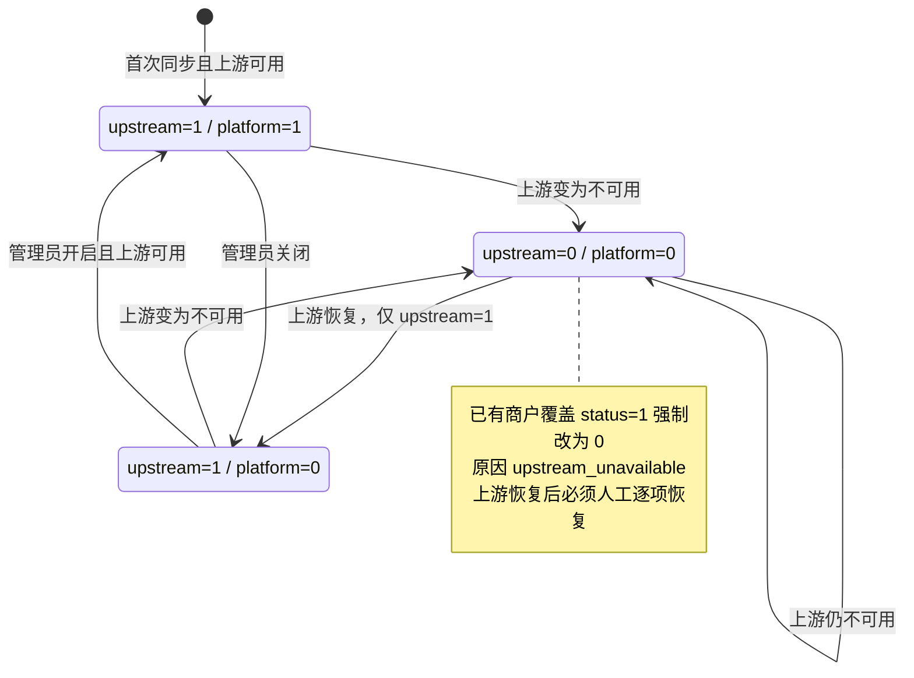
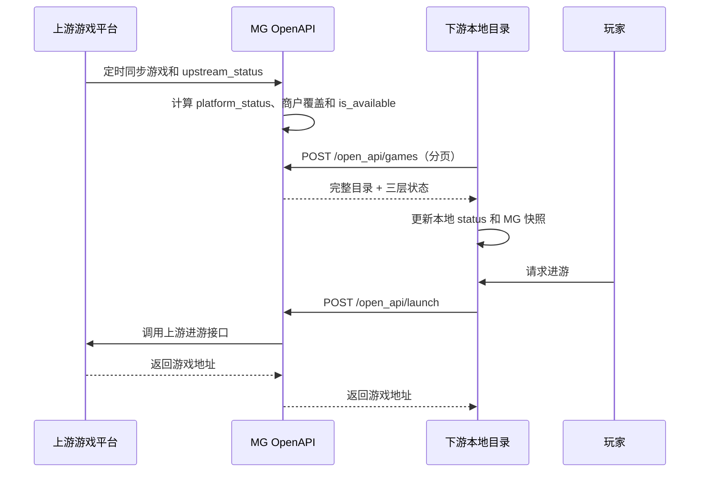

# 游戏目录与商户游戏覆盖改造方案

## 1. 范围与原则

本方案覆盖 MG 游戏目录、上游同步、商户 OpenAPI、MGS 自营目录、下游同步和后台配置。项目尚未上线，允许直接重构，不保留旧接口兼容分支。

原则：

- `mg_games` 保存 MG 资源和上游事实；
- MG 只维护全局运营状态，商户只维护必要的单款覆盖；
- 所有下游每次都拿到完整目录和最终可用状态，自行同步本地目录；
- MGS 与外部合作方的本地状态独立，不能反向修改 MG 状态；
- 状态判断在列表、进游、下注三个入口保持一致；
- 分页固定 `ORDER BY sort ASC, id DESC`。

## 2. 结论

1. `mg_games` 使用两个状态字段：
   - `upstream_status`：上游同步得到的事实，1 可用、0 不可用。
   - `platform_status`：MG 管理员运营状态，1 开启、0 关闭。
2. 上游不可用时，强制 `platform_status=0`，并关闭已有的商户单款覆盖；上游恢复只恢复 `upstream_status`，任何平台或商户状态都必须人工恢复。
3. `mg_merchant_games` 保留为稀疏覆盖表：无记录默认允许；只有单款关闭、费率覆盖或 RTP 覆盖时才写入。
4. `mg_merchant_brands` 只做品牌授权。全量目录模式下没有独立价值，删除表、模型、接口、权限和前端勾选；`mg_game_brands`、`mg_unique_brands` 继续保留用于资源归并和展示。
5. MGS 的 `mgs_games.status` 是 MGS 自己的运营状态；同时保存 MG 返回的状态快照。外部合作方也应采用同样的本地目录和本地状态模型。

## 3. 数据模型

### 3.1 `mg_games`

保留现有游戏名称、编码、品牌、币种、RTP、排序和上游扩展字段，状态字段统一如下：

| 字段 | 维护方 | 含义 |
| --- | --- | --- |
| `upstream_status` | 同步任务 | 上游当前是否提供游戏 |
| `platform_status` | MG 后台/同步任务 | MG 是否允许对外供给 |
| `platform_status_reason` | MG | `upstream_available`、`upstream_unavailable`、`manual_disabled`、`manual_enabled`、`sync_protection` |
| `upstream_status_time` | 同步任务 | UTC 状态快照时间 |
| `platform_status_time` | MG | UTC 状态变更时间 |

`is_open=false` 是游戏平台总开关，来源于 `config/game_platforms.php` 和 `.env`，不写入游戏状态字段；列表和进游时作为 `platform_closed` 参与最终判断。

### 3.2 `mg_merchant_games`

| 字段 | 含义 |
| --- | --- |
| `status` | 商户单款覆盖：0 关闭、1 允许；无记录默认 1 |
| `status_reason` | `manual_disabled`、`upstream_unavailable`、`manual_enabled` |
| `status_time` | UTC 最近一次覆盖状态变更时间 |
| `rate_value` | 可选的单款 GGR 费率覆盖 |
| `default_rtp` | 可选的商户默认 RTP 覆盖 |

上游强制关闭时：已有 `status=1` 记录改为 0 并写入 `upstream_unavailable`，费率和 RTP 保留；已有手动关闭记录不改原因；没有记录的商户不补行。上游恢复后这些记录不会自动改回 1。

商户最终可用公式：

```text
is_available = upstream_status == 1
             && platform_status == 1
             && platform_is_open == true
             && merchant_status == 1       # 无覆盖记录时为 1
             && requested_currency 在 currency_codes
```

### 3.3 `mgs_games` 和下游本地目录

`mgs_games.status` 只表示 MGS 本地是否上架。同步时保存 MG 的 `upstream_status`、`platform_status`、`merchant_status`、`unavailable_reason` 和状态时间作为只读快照。MGS 列表/进游同时检查本地 `status` 和 MG 快照；外部合作方可采用相同规则，但状态只在各自数据库维护。

## 4. 状态流转



规则：

- 新游戏：`upstream_status=1`、`platform_status=1`、原因 `upstream_available`。
- 上游下线：`upstream_status=0`，并强制 `platform_status=0`。
- 上游恢复：只改 `upstream_status=1`，平台状态和商户覆盖保持 0。
- 管理员关闭：仅允许在 `upstream_status=1` 时把平台状态改为 0。
- 管理员开启：仅允许在上游可用且游戏平台总开关打开时执行。
- 同步结果不完整时不批量下线；必要时记录 `sync_protection` 并告警。

## 5. MG 游戏列表 API

接口：`POST /open_api/games`。

接口始终返回完整目录，不因 MG 状态、商户覆盖、币种或品牌映射而隐藏行。仅过滤软删除数据，并支持 `page`、`limit`、`game_id`、`brand_code`、`keyword`。

主要返回字段：

```json
{
  "game_id": "稳定 ID",
  "game_code": "MG 编码",
  "platform_code": "游戏平台",
  "brand_code": "统一品牌编码",
  "currency_codes": ["USD"],
  "currencies": ["USD"],
  "upstream_status": 1,
  "platform_status": 1,
  "merchant_status": 1,
  "status": 1,
  "is_available": true,
  "unavailable_reason": null
}
```

`status` 与 `is_available` 表示本次请求的最终结果；`merchant_status` 无 `mg_merchant_games` 记录时返回 1。下游必须保存完整目录，并按这些字段同步自己的状态，不能只同步可用行。

分页查询固定：

```sql
ORDER BY sort ASC, id DESC
```

## 6. 关键链路

### 6.1 目录同步与进游



### 6.2 资金回调

```text
上游游戏平台 -> MG 回调入口 -> TradeService -> 商户 callback_url
                                      -> 余额/下注/派奖结果
```

下注动作校验当前游戏可用状态；`credit`、`cancel` 允许历史注单继续结算。回调日志必须记录请求摘要、签名结果、商户响应、耗时和最终错误原因。

## 7. 同步实现要求

### 7.1 MG 上游同步

- `is_open=false` 的平台跳过主动同步并返回明确错误。
- 同步按品牌和游戏执行 upsert，更新 `upstream_status` 及时间。
- 只有上游确认的完整结果才处理缺失游戏；缺失游戏按上游不可用处理。
- 上游下线时同步关闭 `platform_status=1` 的游戏，并扫描商户覆盖表。
- 上游恢复不自动开启平台或商户状态。

### 7.2 下游/MGS 同步

- 分页请求直到 `count(distinct game_id) == total`，否则整次失败，不做缺失下线。
- 成功后 upsert 品牌和游戏，更新 MG 快照；缺失游戏只更新快照，不修改本地 `status`。
- 下游本地状态由下游管理员维护，MG 不提供“品牌授权”接口。

## 8. 后台改造

- 游戏资源页展示上游状态、MG 平台状态和状态原因；平台开启按钮在上游不可用时禁止操作。
- 商户配置页删除品牌授权，保留单款状态、费率和 RTP 覆盖；保存无覆盖配置时删除该行，恢复默认允许稀疏化存储。
- MGS 游戏页继续维护本地 `status`，同时展示 MG 快照状态和不可用原因。
- 权限、菜单、接口和前端字段同步删除 `mg_merchant_brands` 相关内容。

## 9. 数据库与迁移

`server/database/schema.sql` 是唯一基线：

- 删除 `mg_merchant_brands`；
- `mg_games.status` 改为双状态字段及时间/原因字段；
- `mg_merchant_games` 删除旧双状态中的冗余字段，保留单一 `status` 并增加原因和时间；
- `mgs_games` 增加 MG 状态快照字段。

旧库先执行 `db:upgrade` 增加新字段，再执行状态回填命令；禁止在请求代码中 DDL，数据回填与结构变更分开。上线前依次执行：

`db:upgrade` 不会删除目标库的额外结构。开发库若仍有旧 `mg_games.status`、`mg_merchant_games.merchant_status` 或 `mg_merchant_brands`，确认数据回填完成后再用一次性维护 SQL 删除；新库直接按 `schema.sql` 安装即可。

```bash
php webman db:upgrade --dry-run
php webman db:upgrade
php webman game:status-backfill
php tests/DbUpgradeSmoke.php
```

## 10. 验收标准

- 新游戏同步后默认对 MG 和所有商户可用，商户表无默认行。
- 上游下线会同时关闭 MG 平台状态和已有商户允许覆盖；上游恢复不会自动开放。
- MG 关闭而下游未同步时，MG 进游和下注均拒绝；下游同步后本地状态变为不可用。
- 游戏列表始终返回完整目录，状态字段与进游校验结果一致。
- MGS 和外部合作方的本地 `status` 不会被 MG 同步覆盖。
- `ORDER BY sort ASC, id DESC` 下分页无重复、无漏项。
- `mg_merchant_brands`、旧品牌授权 API、旧字段引用全部清理。
- 完成 PHP 语法检查、定向 Smoke、前端 lint/build 和 `git diff --check`。
