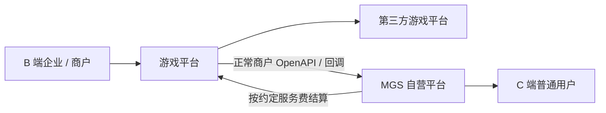
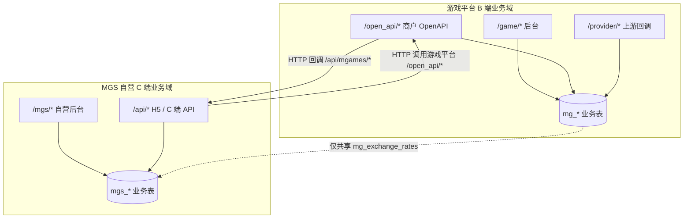
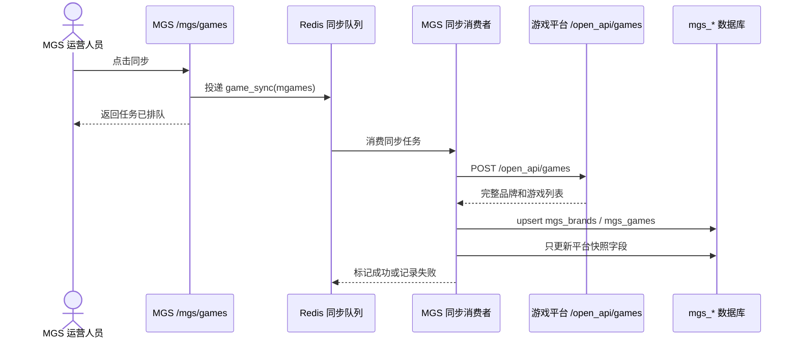
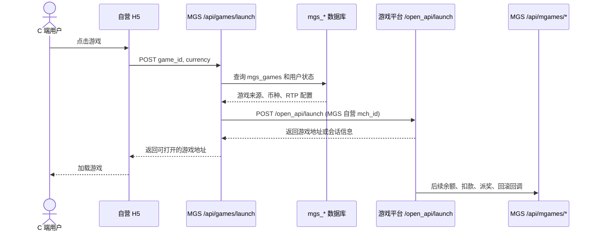
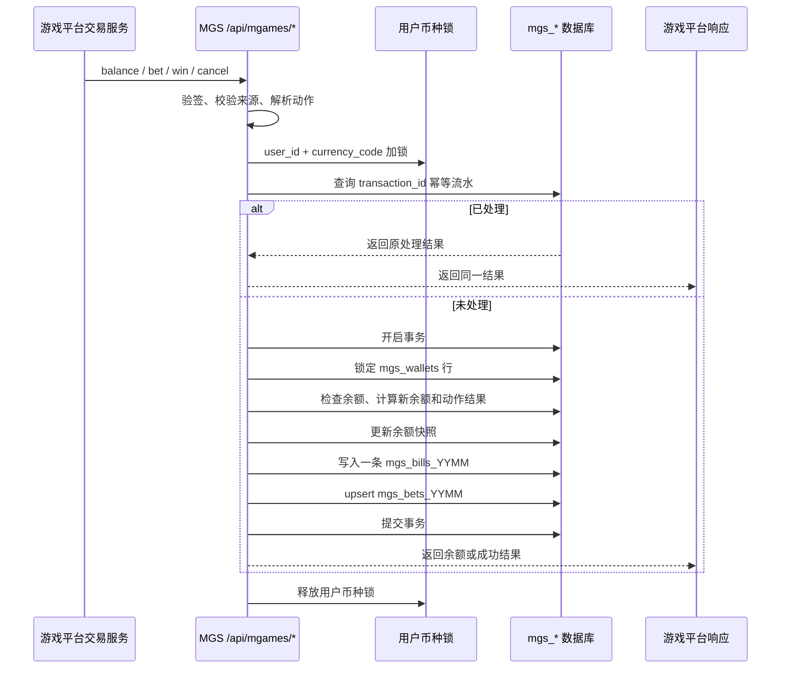
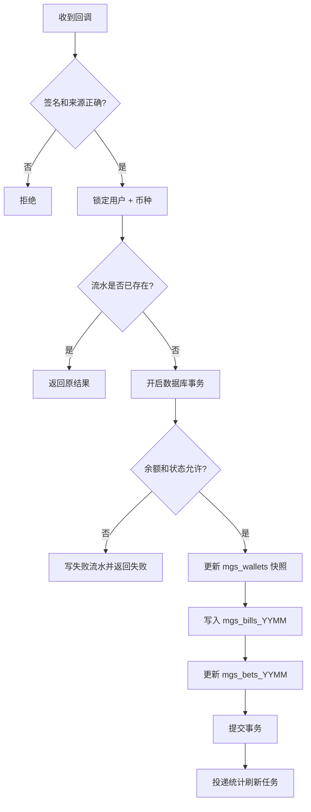
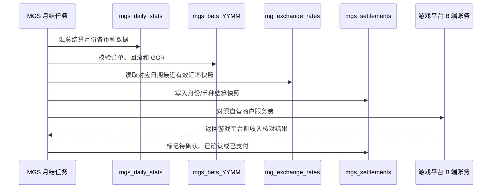
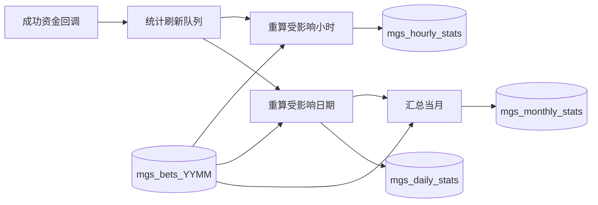

# MGS 自营平台技术文档

## 1. 产品定位

本项目包含两个业务产品，但不是一个业务域：

| 产品 | 客户/用户 | 主要职责 |
| --- | --- | --- |
| 游戏平台 | 企业、商户，属于 B 端 | 接入第三方游戏平台，为企业提供游戏资源、商户参数、进游、钱包回调、注单、流水、计费和报表 |
| MGS 自营平台 | C 端普通用户 | 自己运营游戏产品、用户、钱包、注单、流水、统计和结算 |

MGS 是游戏平台的一个正常客户。游戏平台只把 MGS 当成一套普通商户参数处理；MGS 再通过游戏平台 OpenAPI 获取游戏和进游服务，并接收游戏平台发来的钱包回调。游戏平台的客服、企业负责人、企业子账号只属于 B 端游戏平台，不能直接访问 MGS 的 C 端用户数据。

MGS 不是试玩功能，不使用 `merchant_id=0`，也不把自营数据写入游戏平台的 `mg_*` 业务表。两套业务代码在同一个项目中部署，只是为了复用基础设施；业务数据、Model、Logic、Service、统计和后台菜单必须完全隔离。

### 1.1 设计目标

首期完成以下闭环：

1. MGS 运营人员在后台同步游戏平台游戏，配置自营品牌、游戏状态、排序、费率和 RTP。
2. C 端用户通过 `/api/*` 获取游戏、进游和余额。
3. 游戏平台回调 MGS 时，MGS 完成余额校验、扣款、派奖、取消、回滚、注单和用户流水。
4. MGS 独立生成日报、小时趋势、月度统计和 RTP。
5. MGS 与游戏平台按月、按币种完成部门结算，游戏平台服务费明确记录为游戏平台部门收入。

### 1.2 业务边界



游戏平台负责“为商户提供游戏能力”；MGS 负责“把游戏平台能力包装成自己的 C 端产品”。MGS 不直接接入 WxGame、TADA、AceWin 或 GoldenGateX，这些上游接入仍由游戏平台负责。

## 2. 系统架构与路由

### 2.1 路由边界

游戏平台已有路由必须保持不变：

```text
/game/*                         游戏平台 B 端后台
/open_api/games                 商户调用的游戏列表
/open_api/launch                商户调用的进游接口
/open_api/rtp                   商户调用的 RTP 接口
/open_api/bets                  商户查询注单接口
/provider/{platform}/{action}   上游游戏平台回调入口
```

MGS 新增独立路由：

```text
/mgs/*                          MGS 后台管理，仅自营平台权限可见
/api/games                      C 端游戏列表
/api/games/launch               C 端进游
/api/user                       C 端当前用户信息
/api/wallet                     C 端余额
/api/mgames/balance             游戏平台回调 MGS 余额
/api/mgames/bet                 游戏平台回调 MGS 扣款
/api/mgames/win                 游戏平台回调 MGS 派奖
/api/mgames/cancel              游戏平台回调 MGS 取消/回滚
```

H5 进游接口直接使用 `/api/games/launch`，不增加 `/self`、`/mgs` 等路径层级。H5 不接受 RTP 参数，RTP 只能由 MGS 后台或服务端任务配置。

### 2.2 数据域边界



除共享的 `mg_exchange_rates` 汇率快照外，MGS 不查询游戏平台的 `mg_users`、`mg_bets_*`、`mg_bills_*`、`mg_daily_stats` 或任何其他 `mg_*` 业务表。MGS 不复用游戏平台的 Game、Merchant、User、TradeService 和 Adapter Model；所有跨域业务通信都通过 HTTP。

### 2.3 后台身份

MGS 后台只服务自营平台运营人员和游戏超管：

| 身份 | MGS 能力 | 游戏平台 B 端能力 |
| --- | --- | --- |
| 游戏超管 | 全部 MGS 游戏、用户、注单、流水、统计、结算和配置 | 全部游戏平台能力 |
| 自营运营人员 | MGS 游戏配置、用户、注单、流水和统计 | 无企业和商户管理权限 |
| 企业负责人 | 无 MGS 权限 | 本企业商户、玩家、注单、流水和报表 |
| 企业子账号 | 无 MGS 权限 | 被分配商户范围内的数据 |

“自营平台”是独立的顶级后台菜单，企业负责人和企业子账号不显示该菜单。MGS 后台不显示游戏平台顶部的商户参数切换器，也不把 MGS 用户伪装成游戏平台商户玩家。

## 3. 初始化与配置

### 3.1 游戏平台自营商户

首次执行 `db:upgrade` 时，在游戏平台 `mg_merchants` 中创建一条正常的自营商户记录。该商户不是隐藏商户，也不是特殊数据类型，游戏平台对它执行与其他商户完全一致的进游、回调、计费和注单逻辑。

初始化字段从 `.env` 读取（密钥只放环境变量，不写文档）：

```text
MGS_GAME_PLATFORM_URL=http://127.0.0.1:8787
MGS_GAME_PLATFORM_CALLBACK_URL=http://127.0.0.1:8787/api/mgames
MGS_GAME_PLATFORM_MCH_ID                 # 可留空，首次安装后自动生成并固定
MGS_GAME_PLATFORM_SECRET                  # 必填，不在文档或页面展示
MGS_DEFAULT_CURRENCY=USD
MGS_TIMEZONE=UTC
```

MGS 只保存这条商户的业务引用或 `mch_id`，不直接读取游戏平台数据库。生产环境修改自营商户参数时，先在游戏平台 B 端完成配置，再由 MGS 配置中心更新对应的 HTTP 客户端参数。

### 3.2 MGS 配置

MGS 自己的 `mgs_configs` 保存非敏感配置，例如：

| 配置 | 说明 |
| --- | --- |
| `platform_timezone` | MGS 报表和账期使用的 IANA 时区，具体时刻仍以 UTC 入库 |
| `default_currency_code` | C 端默认币种 |
| `default_language` | C 端默认语言 |
| `platform_fee_rate` | MGS 与游戏平台约定的服务费率默认值 |
| `game_platform_mch_id` | 游戏平台自营商户 `mch_id` |

游戏平台 OpenAPI 地址、回调地址和签名密钥只放 `.env`（对应 `MGS_GAME_PLATFORM_URL`、`MGS_GAME_PLATFORM_CALLBACK_URL`、`MGS_GAME_PLATFORM_SECRET`），不写数据库、代码、日志或文档。`mgs_configs` 读取经过 MGS 自己的永久缓存，后台修改后立即重建缓存；不得每次请求直接查数据库。

### 3.3 配置与 Redis Key

游戏平台的 `mg_configs` 和 MGS 的 `mgs_configs` 分别维护，不能混用配置缓存。自有 Redis Key 统一放在 `server/app/enum/RedisKey.php`，按 `Lock`、`Forever`、`Temp` 分组：

```text
LockMgsConfigsRebuild   lock:mgs:configs:rebuild
ForeverMgsConfigs       forever:mgs:configs
TempMgsLaunch           temp:mgs:launch:{request_id}
```

每个 Key 必须在 Enum 中注明类型、用途、完整格式和 TTL。延迟队列使用框架或队列组件自己的 Key，不改框架 Key。

## 4. MGS 数据库设计

### 4.1 表命名与隔离

MGS 所有业务表统一使用 `mgs_` 前缀，Model 放在 `server/app/model/mgs/`。所有具体时刻使用 UTC `DATETIME(3)`，金额使用 `DECIMAL`，资金计算使用 BCMath，禁止使用 `float`。

| 表 | 作用 |
| --- | --- |
| `mgs_configs` | 自营平台非敏感配置 |
| `mgs_brands` | 从游戏平台同步的品牌快照 |
| `mgs_games` | MGS 可运营游戏和平台来源快照 |
| `mgs_users` | C 端用户、业务用户编号和可选昵称 |
| `mgs_wallets` | 用户按币种的当前余额快照 |
| `mgs_bets_template` | 注单月表模板 |
| `mgs_bets_YYMM` | 每局注单、累计金额、GGR、RTP 和费用快照 |
| `mgs_bills_template` | 用户流水月表模板 |
| `mgs_bills_YYMM` | 唯一的用户资金流水表 |
| `mgs_daily_stats` | MGS 日汇总 |
| `mgs_hourly_stats` | MGS 小时趋势 |
| `mgs_monthly_stats` | MGS 月度趋势 |
| `mgs_settlements` | MGS 与游戏平台部门结算 |

不创建 `mgs_wallet_bills`。`mgs_wallets` 是余额快照，不是流水表；充值、扣款、派奖、取消、回滚和人工调整全部写入 `mgs_bills_YYMM`，任何余额变化都必须能通过这张表追溯。

### 4.2 游戏与品牌

`mgs_brands` 保存游戏平台返回的品牌快照，至少包括：

```text
id, platform, platform_brand_code, name, names, logo_url,
sort, status, create_time, update_time
```

`mgs_games` 保存 MGS 自己的运营配置和游戏平台来源字段：

```text
id                         MGS 游戏主键，H5 直接使用
sort                       MGS 展示排序
platform                   固定为 mgames
brand_id                   mgs_brands.id
platform_brand_code        游戏平台返回的品牌编码
platform_game_id           游戏平台游戏主键
platform_game_code         游戏平台游戏编码
real_game_code             游戏平台实际游戏编码快照
name, names                游戏名称
icon_url, banner_url       图片
game_type                  类型
currency_codes             支持币种 JSON
status                     MGS 是否开放
is_hot, is_new             MGS 展示标签
support_rtp                是否支持 RTP
rtp_options                RTP 可选值 JSON
default_rtp                MGS 默认 RTP
rate_value                 MGS 与游戏平台的约定费率
create_time, update_time, delete_time
```

MGS 不生成第二套 `game_code`，也不把上游平台标识拼进对外编号。H5 只传 `mgs_games.id`，MGS 服务端再根据来源字段调用游戏平台。

### 4.3 用户、余额与流水

`mgs_users` 保存 C 端用户资料，不保存密码和余额：

```text
id, user_no, nickname, language, status, last_login_time,
create_time, update_time, delete_time
```

`mgs_wallets` 使用 `user_id + currency_code` 唯一索引，保存快速读取所需的当前状态：

```text
id, user_id, currency_code, balance, version, update_time
```

`mgs_bills_YYMM` 是唯一资金流水表，每个资金动作一行：

```text
bill_no, user_id, currency_code, bill_type, direction, amount,
before_balance, after_balance, transaction_id, original_transaction_id,
bet_no, status, request_hash, create_time
```

成功流水不可修改和删除；取消、回滚和人工调整都新增反向流水。`before_balance`、`after_balance` 用于审计和重建余额，`transaction_id + bill_type` 建立唯一幂等索引。

### 4.4 注单与月份表

`mgs_bets_YYMM` 每局一行，保存：

```text
bet_no, user_id, game_id, currency_code, status,
bet_amount, bet_rollback_amount, win_amount, win_rollback_amount,
ggr_amount, rtp_value, rate_value, platform_fee, actions,
create_time, update_time, settle_time
```

注单号和流水号包含 UTC 创建日期，例如：

```text
MB + YYMMDD + HHmmss + 随机串
ML + YYMMDD + HHmmss + 随机串
```

已知编号时从 `YYMM` 直接定位月份表；按日期范围查询时先把 MGS 时区日期换算成 UTC 起止时间，再查询涉及的月表、合并排序和分页。正常回调未命中当前月份时最多查询前两个月，不建立全量三方单号路由表。

每月计划任务预建当月和未来两个月表；请求发现缺表时使用命名锁和 `CREATE TABLE IF NOT EXISTS ... LIKE template` 补建。月份表结构只维护模板，`db:upgrade` 同步已存在月份表。

### 4.5 数据关系图

```mermaid
erDiagram
    MGS_USERS ||--o{ MGS_WALLETS : owns
    MGS_USERS ||--o{ MGS_BETS : creates
    MGS_USERS ||--o{ MGS_BILLS : owns
    MGS_BRANDS ||--o{ MGS_GAMES : contains
    MGS_GAMES ||--o{ MGS_BETS : receives
    MGS_BETS ||--o{ MGS_BILLS : produces
    MGS_WALLETS ||--o{ MGS_BILLS : changes
    MGS_USERS {
        bigint id PK
        varchar user_no UK
        varchar nickname
        tinyint status
    }
    MGS_WALLETS {
        bigint id PK
        bigint user_id FK
        varchar currency_code
        decimal balance
        bigint version
    }
    MGS_BETS {
        varchar bet_no PK
        bigint user_id FK
        bigint game_id FK
        decimal bet_amount
        decimal win_amount
        decimal ggr_amount
    }
    MGS_BILLS {
        varchar bill_no PK
        bigint user_id FK
        varchar transaction_id UK
        decimal amount
        decimal before_balance
        decimal after_balance
    }
```



## 5. 游戏同步流程

MGS 不接入第三方游戏平台 Adapter。同步由 MGS 后台异步投递任务，任务消费者使用 HTTP 请求游戏平台 `/open_api/games`，确保同步过程不会阻塞后台请求。



同步规则：

1. `platform` 固定为 `mgames`，以 `platform_brand_code` 和 `platform_game_id` 做唯一定位。
2. 平台返回的名称、图片、币种和来源编码可以更新；MGS 自己的 `status`、排序、费率和 RTP 不被覆盖。
3. 只有拿到完整成功结果后，才把本次缺失的游戏标记为下线；请求失败不能批量下架。
4. 同步任务重复执行结果不变，同一时间只允许一个 `mgames` 同步任务运行。

## 6. C 端进游流程

### 6.1 接口

```text
GET  /api/games
POST /api/games/launch
GET  /api/user
GET  /api/wallet
```

`/api/games/launch` 请求至少包括 `game_id`、`currency` 和 C 端登录凭证；`game_id` 是 `mgs_games.id`。昵称可以在用户注册或首次进游时写入，但不作为必填字段。签名密钥只由自营 H5 的服务端保存和调用，不能下发到浏览器；浏览器通过 H5 服务端转发或使用其短期登录凭证访问这些接口。

### 6.2 时序



进游时 MGS 只校验自己的游戏状态、用户状态和币种，然后调用游戏平台 OpenAPI。MGS 不直接连接游戏平台数据库，不直接拼上游 URL，不接受 H5 传入的 RTP。

## 7. 钱包回调与用户流水

### 7.1 回调关系

游戏平台已经把 MGS 当成普通商户，因此回调地址配置在游戏平台自营商户的 `callback_url` 中：

```text
POST http://127.0.0.1:8787/api/mgames/balance
POST http://127.0.0.1:8787/api/mgames/bet
POST http://127.0.0.1:8787/api/mgames/win
POST http://127.0.0.1:8787/api/mgames/cancel
```

生产环境只替换域名，不改变 `/api/mgames/*` 路径。请求验签使用游戏平台商户参数的 `mch_id`、`timestamp` 和 `sign`；`transaction_id`、`original_transaction_id` 和金额都按字符串处理。

### 7.2 一次回调的处理时序



数据库事务内不等待远程 HTTP。余额不足、用户冻结等确定失败直接返回失败；网络超时和连接中断属于结果未知，游戏平台使用同一 `transaction_id` 重试，MGS 依靠唯一索引返回原结果。

### 7.3 资金写入规则



`mgs_wallets` 只保存当前余额；`mgs_bills_YYMM` 保存完整资金事实。回滚和取消不修改历史成功流水，而是新增方向相反的流水并更新注单累计字段。

流水幂等唯一范围为“用户 + 币种 + 三方交易号 + 动作”，不同用户或币种即使使用相同三方交易号也不会互相命中结果。

## 8. 账务、RTP 与部门结算

### 8.1 自营账务口径

MGS 按游戏平台普通商户的交易语义处理：

```text
ggr_amount = (bet_amount - bet_rollback_amount)
           - (win_amount - win_rollback_amount)

billable_ggr_amount = max(ggr_amount, 0)
platform_fee = billable_ggr_amount × rate_value
rtp = win_amount / bet_amount
mgs_net_amount = ggr_amount - platform_fee
```

每笔注单固化 `rate_value`、`platform_fee`、RTP 和实际金额，后续修改配置不影响历史账务。负 GGR 如实保留，不自动跨期抵扣。

游戏平台部门仍按正常商户逻辑记录自营商户的服务费收入；第三方游戏平台的上游成本仍属于游戏平台部门，不直接写成 MGS 的成本。MGS 的部门结算只记录双方约定的服务费和 MGS 净额。

### 8.2 结算流程



`mgs_settlements` 至少保存：

```text
settlement_no, settlement_month, currency_code,
bet_amount, win_amount, ggr_amount, rate_value,
platform_fee, mgs_net_amount, exchange_rate_id,
exchange_rate_value, status, paid_time, create_time, update_time
```

SC 视为 USD 价值参与结算；GC 只统计数量、下注、派奖和流水，完全不进入汇率换算、服务费、成本和利润。不同币种不能直接相加，平台需要合计时必须按汇率快照换算到配置的统计币种，并同时保存汇率 ID 和实际采用的汇率值。

## 9. 自营统计

### 9.1 统计表与指标

MGS 独立维护 `mgs_daily_stats`、`mgs_hourly_stats` 和 `mgs_monthly_stats`，不读取游戏平台统计表：

| 指标 | 小时 | 日 | 月 |
| --- | --- | --- | --- |
| 去重用户数 | 支持 | 支持 | 支持 |
| 注单量 | 支持 | 支持 | 支持 |
| 下注额 | 各币种分开 | 各币种分开 | 各币种分开 |
| 派奖额 | 各币种分开 | 各币种分开 | 各币种分开 |
| 回滚额 | 各币种分开 | 各币种分开 | 各币种分开 |
| GGR | 各币种分开 | 各币种分开 | 各币种分开 |
| RTP | 下注额大于 0 时计算 | 同左 | 同左 |
| 平台服务费 | 按费率计算 | 按费率计算 | 按月结算快照 |

金额永远按币种分列。GC 可以进入用户量、注单量和原始流水，但不会进入有价值金额。

### 9.2 时区与增量刷新

所有具体时间入库 UTC；`mgs_configs.platform_timezone` 只负责把 UTC 时间转换成自营平台的日、小时和月份。修改时区必须重建受影响的统计日期，不能直接改历史标签。



刷新策略：

1. 资金动作成功后投递平台时区对应的小时、日期和月份任务；相同时间桶只保留一条待执行任务。
2. 消费者把时间桶换算为 UTC 起止时间，从涉及的注单月表重新计算去重用户、注单量和金额，再用唯一键整行覆盖。
3. 每 5 分钟补算当前小时和上一小时，补偿队列延迟、晚到派奖和回滚；重复执行结果不变。
4. 日统计滚动更新，日界结束后完整校准；月统计每小时汇总日报，月初完整确认上月。

## 10. 后台功能与接口权限

### 10.1 MGS 后台菜单

```text
/mgs/overview       自营概览
/mgs/games          自营游戏配置
/mgs/games/sync     同步游戏平台游戏
/mgs/users          C 端用户
/mgs/bets           自营注单
/mgs/bills          用户流水
/mgs/reports        日、小时、月度统计
/mgs/settlements    部门结算
```

权限码统一使用 `app:mgs:<功能>:<动作>`。所有接口后端校验 MGS 角色，前端 `v-permission` 只负责隐藏按钮，不能代替后端权限。

游戏配置页面只展示 MGS 的品牌和游戏配置，不展示企业商户参数，不允许企业负责人上架或修改自营游戏。注单页面展示每局累计金额、RTP、GGR、服务费和动作明细；流水页面展示 `mgs_bills_YYMM` 的余额前后快照和回调交易号。

### 10.2 C 端接口

```text
GET  /api/games
POST /api/games/launch
GET  /api/user
GET  /api/wallet
```

C 端接口只返回 C 端需要的数据，不返回内部费率、平台成本、上游平台编码、签名密钥或后台统计技术字段。余额接口从 `mgs_wallets` 读取；若快照缺失，由后台任务从 `mgs_bills_YYMM` 重建后再提供服务。

## 11. 代码结构与实现约束

后端：

```text
server/app/controller/mgs/
server/app/logic/mgs/
server/app/model/mgs/
server/app/service/mgs/
server/app/validate/mgs/
```

前端：

```text
saiadmin-artd/src/views/mgs/
saiadmin-artd/src/api/mgs/
```

MGS 通过 `MgsGamePlatformClient` 调用游戏平台 OpenAPI，客户端只负责 URL、签名、请求和响应转换；不引用游戏平台的 Model、TradeService、Adapter 或数据库连接。业务仍保持 `Controller -> Logic -> Model -> DB`，只有跨 Logic 复用的能力才进入 Service。

Controller 只取参、校验和调用 Logic；Logic 负责权限、事务、幂等和数据组装；Model 只负责 `mgs_*` 表映射。Controller、前端和 HTTP 客户端不得自行拼月份表名，统一交给月份表服务。

## 12. 数据库升级与内置数据

`server/database/schema.sql` 增加完整的 `mgs_*` 固定表和模板表结构，字段、索引和 COMMENT 一次定义；`db:upgrade` 在目标业务库内使用临时比对表同步结构，重复执行无差异，不要求额外创建永久临时库。

`server/database/system.php` 定义：

- MGS 顶级菜单、子菜单和按钮。
- MGS 超管和自营运营角色及权限。
- MGS 初始配置定义。
- 首次安装时游戏平台自营商户的初始化数据定义。

升级规则：只补充和更新代码定义，不覆盖已经保存的 MGS 配置、账号密码和任务启停状态；游戏平台自营商户的回调地址与签名密钥以 `.env` 为准，仅在值变化时同步。请求代码不执行 DDL，不把业务数据写入 schema 基线。

## 13. 测试与验收

至少覆盖以下场景：

1. MGS 后台和 C 端路由可用，游戏平台原有路由行为不变。
2. MGS 查询只访问 `mgs_*` 表；除汇率外不读取 `mg_*` 业务表。
3. 游戏同步异步排队、重复同步幂等、游戏平台接口失败不下架旧游戏。
4. H5 传 `mgs_games.id` 可以进游，H5 不能设置 RTP，游戏平台返回错误能明确传回。
5. 余额、扣款、派奖、取消、回滚都只产生一条对应用户流水；重复回调返回原结果。
6. 并发扣款不会超扣，流水的 `before_balance` 和 `after_balance` 连续一致。
7. 跨月注单和流水查询能正确定位多个 UTC 月表，迟到回调不会依赖路由大表。
8. SC 按 USD 价值统计，GC 完整记录但不进入财务金额和结算。
9. 日、小时、月度统计按 `mgs_configs.platform_timezone` 生成，重复刷新不会重复累计。
10. 部门结算能按币种生成，汇率缺失使用最近有效快照并保存汇率 ID 与实际值。
11. 游戏超管、自营运营人员、企业负责人和企业子账号的菜单、接口权限互相隔离。
12. `db:upgrade` 空库首次安装、重复执行、结构差异补齐和菜单权限增量同步均通过。

本期完成标准：MGS 能作为游戏平台的正常 B 端客户完成“同步游戏 -> C 端进游 -> 游戏平台回调 -> 用户余额和流水 -> 自营统计 -> 部门结算”的闭环；游戏平台原有 B 端业务和路由不受影响。
